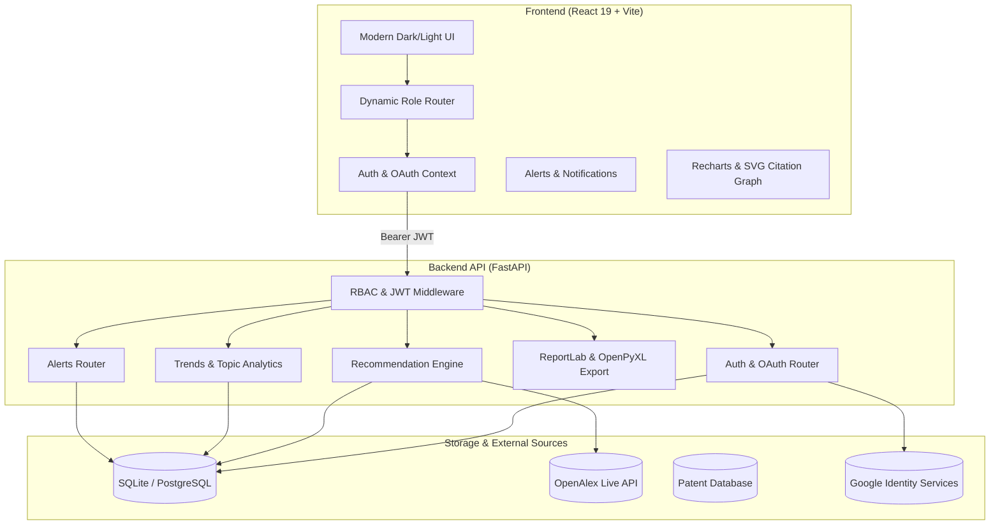

# 🚀 AI Research Funding & Innovation Intelligence Platform

<div align="center">

[](https://fastapi.tiangolo.com)
[](https://react.dev)
[](https://vitejs.dev)
[](https://www.python.org)
[](https://www.docker.com)
[](LICENSE)

**An intelligent end-to-end intelligence engine connecting researchers, startups, innovation managers, and executives to grants, open research literature, patent portfolios, and commercialization pathways.**

[Live Architecture](#-system-architecture) • [Key Features](#-key-features) • [Quick Start](#-quick-start) • [Role Ecosystem](#-role-based-ecosystem) • [API Reference](#-api-endpoints) • [Deployment](#-docker-deployment)

</div>

---

## 📖 Overview

The **AI Research Funding & Innovation Intelligence Platform** bridges academic research and real-world industrial commercialization. By integrating live scholarly publication data (via **OpenAlex**), patent intelligence, and grant listings, the system delivers multi-criteria AI recommendations, emerging technology forecasting, and enterprise-grade executive reporting.

---

## 🌟 Key Features

### 🔐 1. Authentication & Enterprise Security (RBAC)
- **Multi-Persona Role-Based Access Control (RBAC):** First-class support for `RESEARCHER`, `STARTUP_FOUNDER`, `INNOVATION_MANAGER`, and `ADMIN`.
- **Google OAuth 2.0 Integration:** One-click Google Sign-In with automated user onboarding and token verification.
- **Secure JWT Tokens:** Encrypted role payload, bcrypt password hashing, and session tracking via login history audits.

### 🎯 2. AI Recommendation & Grant Matching
- **Multi-Criteria Scoring Engine:** Matches researchers with grants using Jaccard semantic similarity across keywords, research area, and eligibility constraints.
- **Match Breakdown:** Transparent match percentage metrics with detailed grant deadlines, funding limits, and direct application links.

### 🔔 3. Real-Time Notification & Alert Center
- **Interactive Notification Bell:** Live unread counters, notification dropdowns, and status management (mark-as-read, delete).
- **Simulated Intelligence Triggers:** Instant simulation of background web crawlers detecting new matching grants or competitor patent filings.

### 🌐 4. Research Intelligence & Citation Network
- **Live Paper Discovery:** Real-time paper search and citation tracking powered by the OpenAlex API.
- **Deep Citation Network Graph:** Interactive SVG node-link visualization mapping core foundational papers to their citations and references.
- **Emerging Keyword Forecasting:** Historical trend analytics detecting surging and declining research domains.

### 💡 5. Patent Landscape & Innovation Scoring
- **Patent Intelligence:** Categorized search by IPC classification, filing jurisdiction, and assignee.
- **5-Factor Innovation Scoring:** Algorithmic scoring across **Novelty (30%)**, **Strength (20%)**, **Market Potential (20%)**, **Maturity (15%)**, and **Funding Alignment (15%)**.
- **Commercialization Pathways:** Actionable advisory matrix (e.g., *Direct Spinout, Technology Licensing, Industry Partnership, Open Source Academic*).

### 📑 6. Executive Dashboards & Export Engine
- **Role-Tailored Views:** Dynamic UI routing that automatically presents the right dashboard per user persona.
- **Publication-Ready Exports:** High-resolution PDF briefs (ReportLab) and multi-tab formatted Excel spreadsheets (OpenPyXL).

---

## 🏛 System Architecture



---

## 👥 Role-Based Ecosystem

| Persona | Primary Dashboard | Key Features & Privileges |
| :--- | :--- | :--- |
| 🎓 **Researcher** | `ResearchDashboard` | Grant matching, live paper search, citation networks, publication trend analytics, portfolio profile. |
| 🚀 **Startup Founder** | `InnovationDashboard` | Patent landscape, innovation scoring, commercialization roadmaps, investor-ready report downloads. |
| 🏢 **Innovation Manager** | `InnovationDashboard` | Technology intelligence, competitive patent tracking, portfolio management, ecosystem alerts. |
| 👑 **Administrator** | `ExecutiveDashboard` | Platform-wide KPIs, executive PDF/Excel exports, system health monitoring, user audits. |

---

## 📁 Repository Structure

```text
├── backend/
│   ├── alerts/            # Notification & alert system endpoints
│   ├── analytics/         # Publication trends, keyword extraction, citation network
│   ├── auth/              # JWT auth, Google OAuth, RBAC dependencies
│   ├── dashboard/         # Aggregated metrics for user & executive dashboards
│   ├── database/          # SQLAlchemy models, SQLite/Postgres DB setup, migrations
│   ├── funding/           # Funding opportunity search and filtering
│   ├── innovation/        # Patent analytics, innovation scoring, commercialization
│   ├── patents/           # Patent data retrieval and IPC mapping
│   ├── profile/           # User profile & enriched portfolio management
│   ├── recommendation/    # Jaccard grant matching & scoring engine
│   ├── reports/           # PDF (ReportLab) & Excel (OpenPyXL) generation
│   ├── main.py            # FastAPI entry point & CORS configuration
│   └── requirements.txt   # Python dependencies
├── frontend/
│   ├── src/
│   │   ├── api/           # Axios HTTP client configuration
│   │   ├── components/    # AppLayout, DashboardRouter, RoleRoute, NotificationPanel
│   │   ├── context/       # Theme and authentication providers
│   │   ├── pages/         # Login, Register, Profile, Dashboards, Analytics
│   │   ├── App.jsx        # Routing configuration & route protection
│   │   └── index.css      # Design system with responsive themes & animations
│   ├── package.json       # React dependencies
│   └── vite.config.js     # Vite bundler configuration
├── docker-compose.yml     # Multi-container orchestration
├── Dockerfile             # Production backend container definition
├── DEPLOYMENT.md          # Cloud deployment guide (AWS, Render, Docker)
└── README.md              # Project documentation
```

---

## 🚀 Quick Start

### Prerequisites
- **Python 3.11+**
- **Node.js 18+** and **npm**
- **Git**

---

### 1. Clone the Repository
```bash
git clone https://github.com/springboardmentor1/Research-Funding-Innovation-Intelligence-Platform.git
cd Research-Funding-Innovation-Intelligence-Platform-New
```

---

### 2. Backend Setup
```bash
cd backend

# Create and activate a virtual environment
python -m venv venv
# On Windows:
venv\Scripts\activate
# On macOS/Linux:
# source venv/bin/activate

# Install dependencies
pip install -r requirements.txt

# Run automatic database migrations
python database/migrate.py

# Launch the backend server
uvicorn main:app --reload --port 8000
```
> 📍 Backend will be live at: **`http://127.0.0.1:8000`**  
> 📖 Interactive Swagger API Docs: **`http://127.0.0.1:8000/docs`**

---

### 3. Frontend Setup
```bash
cd ../frontend

# Install dependencies
npm install

# (Optional) Configure environment variables
# Copy .env example if not already present
# Make sure VITE_API_BASE_URL points to http://127.0.0.1:8000

# Start the Vite development server
npm run dev
```
> 📍 Frontend will be live at: **`http://localhost:5173`**

---

## 🔑 Google OAuth 2.0 Configuration

To enable **Sign in with Google**:
1. Open the [Google Cloud Console](https://console.cloud.google.com/).
2. Navigate to **APIs & Services > Credentials** and create an **OAuth Client ID** (Web application).
3. Set **Authorized JavaScript origins** to `http://localhost:5173`.
4. Set **Authorized redirect URIs** to `http://localhost:5173`.
5. Copy your **Client ID** into `frontend/.env`:
   ```env
   VITE_API_BASE_URL=http://127.0.0.1:8000
   VITE_GOOGLE_CLIENT_ID=your-google-client-id.apps.googleusercontent.com
   ```
6. Restart your frontend server (`npm run dev`).

---

## 📡 API Endpoints

<details>
<summary><b>🔍 View Complete API Endpoint Directory</b></summary>

### 🛡️ Authentication & User Management
| Method | Endpoint | Description | Access |
| :--- | :--- | :--- | :--- |
| `POST` | `/auth/register` | Register a new user with a specific role | Public |
| `POST` | `/auth/login` | Authenticate and obtain JWT access token | Public |
| `POST` | `/auth/google` | Authenticate via Google OAuth ID token | Public |
| `POST` | `/auth/logout` | Invalidate token and session | Public |

### 👤 Profile & Portfolio Management
| Method | Endpoint | Description | Access |
| :--- | :--- | :--- | :--- |
| `GET` | `/profile/{user_id}` | Retrieve profile details and academic portfolio | Authenticated |
| `POST` | `/profile/` | Create or update profile, DOIs, and patent links | Authenticated |

### 🔔 Alerts & Notifications
| Method | Endpoint | Description | Access |
| :--- | :--- | :--- | :--- |
| `GET` | `/alerts` | Get user notifications and unread status | Authenticated |
| `PUT` | `/alerts/{id}/read` | Mark a notification as read | Authenticated |
| `DELETE` | `/alerts/{id}` | Dismiss and delete a notification | Authenticated |
| `POST` | `/alerts/trigger-synthetic` | Generate mock personalized alerts | Authenticated |

### 📊 Research & Analytics
| Method | Endpoint | Description | Access |
| :--- | :--- | :--- | :--- |
| `GET` | `/research/search` | Search open literature via OpenAlex API | Authenticated |
| `GET` | `/analytics/publication-trends`| Historical publication trajectory by topic | Authenticated |
| `GET` | `/analytics/top-keywords` | Emerging research keywords and growth rates | Authenticated |
| `GET` | `/analytics/citation-network` | Deep citation node graph and reference links | Authenticated |

### 💡 Funding & Innovation
| Method | Endpoint | Description | Access |
| :--- | :--- | :--- | :--- |
| `GET` | `/funding` | Search and filter grants | Authenticated |
| `GET` | `/recommendations` | AI-matched funding opportunities | Authenticated |
| `GET` | `/patents` | Search patent records and assignees | Authenticated |
| `GET` | `/innovation/scores` | 5-factor innovation composite scoring | Authenticated |
| `GET` | `/innovation/commercialization`| Commercialization advisory recommendations | Authenticated |

### 📑 Reports & Downloads
| Method | Endpoint | Description | Access |
| :--- | :--- | :--- | :--- |
| `GET` | `/reports/funding/pdf` | Generate comprehensive Funding PDF | Executive / Admin |
| `GET` | `/reports/innovation/pdf` | Generate Technology & Patent PDF | Executive / Admin |
| `GET` | `/reports/funding/excel` | Multi-sheet Excel data export | Executive / Admin |

</details>

---

## 🐳 Docker Deployment

To spin up the entire multi-container production environment using Docker Compose:

```bash
# Build and run containers in detached mode
docker compose up --build -d

# Verify container health
docker compose ps
```

| Service | Port | Description |
| :--- | :--- | :--- |
| **Frontend** | `5173` | React web application served with Nginx |
| **Backend** | `8000` | FastAPI application with production Uvicorn workers |

---

## 🧪 Testing

Run the automated backend test suite with Pytest:

```bash
cd backend
python -m pytest tests/ -v --tb=short
```

---

## 📄 License

This project is open-source software licensed under the **MIT License**.

<div align="center">
  <sub>Built with ❤️ for researchers, innovators, and entrepreneurs worldwide.</sub>
</div>
