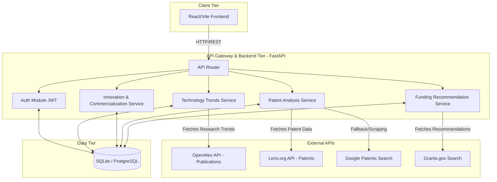

# Research Funding & Innovation Intelligence Platform Architecture

```mermaid
graph TD
    subgraph Client [Client Tier]
        UI[React/Vite Frontend]
    end

    subgraph API [API Gateway & Backend Tier - FastAPI]
        Router[API Router]
        Auth[Auth Module JWT]
        FundingService[Funding Recommendation Service]
        PatentService[Patent Analysis Service]
        InnovationService[Innovation & Commercialization Service]
        TechService[Technology Trends Service]
    end

    subgraph Data [Data Tier]
        DB[(SQLite / PostgreSQL)]
    end

    subgraph External [External APIs]
        OpenAlex[OpenAlex API - Publications]
        Lens[Lens.org API - Patents]
        GooglePatents[Google Patents Search]
        GrantsGov[Grants.gov Search]
    end

    %% Connections
    UI -- HTTP/REST --> Router
    Router --> Auth
    Router --> FundingService
    Router --> PatentService
    Router --> InnovationService
    Router --> TechService

    FundingService <--> DB
    PatentService <--> DB
    InnovationService <--> DB
    TechService <--> DB
    Auth <--> DB

    FundingService -- Fetches Recommendations --> GrantsGov
    PatentService -- Fetches Patent Data --> Lens
    PatentService -- Fallback/Scraping --> GooglePatents
    TechService -- Fetches Research Trends --> OpenAlex
```
