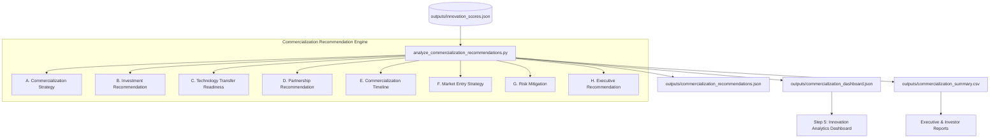

# Commercialization Recommendations — Documentation

## Module Architecture & Overview

The **Commercialization Recommendation Engine** (Step 4) translates the quantitative scores generated during Step 3 (**Innovation Scoring Workflow**) into actionable strategic guidance for technology commercialization, IP licensing, R&D investment, risk mitigation, and go-to-market execution.

The engine evaluates each technology domain across 8 decision modules:
1. **Commercialization Strategy Recommendation**: Evaluates optimal commercialization pathways (`Immediate Market Launch`, `Licensing`, `Joint Venture`, `Strategic Partnership`, `Startup Incubation`, `Continue Research & Development`).
2. **Investment Recommendation**: Calculates composite investment priority (`Very High Investment Priority`, `High Investment Priority`, `Medium Investment Priority`, `Low Investment Priority`).
3. **Technology Transfer Readiness**: Measures technology transfer readiness stage (`Ready for Technology Transfer`, `Pilot Deployment Recommended`, `Prototype Validation Required`, `Research Stage`).
4. **Partnership Recommendation**: Recommends key collaboration profiles (`Industry`, `Universities`, `Government Agencies`, `Incubators`, `Venture Capital`, `Research Labs`).
5. **Commercialization Timeline**: Estimates expected launch duration (`0–1 Years`, `1–3 Years`, `3–5 Years`, `5+ Years`).
6. **Market Entry Strategy**: Determines target market entry route (`Domestic Market`, `International Expansion`, `Niche Market`, `Enterprise Adoption`, `Government Adoption`).
7. **Risk Mitigation**: Generates actionable guidance for technology, market, readiness, and competitive risks.
8. **Executive Recommendation**: Synthesizes a unified leadership narrative summarizing strategy, investment priority, readiness, partnership target, timeline, and entry mode.

---

## Workflow Diagram



---

## Decision Rules & Evaluation Methodology

### A. Commercialization Strategy Recommendation
Determined by evaluating Readiness Score ($S_{\text{readiness}}$), Overall Score ($S_{\text{overall}}$), Technology Risk Score ($S_{\text{risk}}$), Market Opportunity Score ($S_{\text{opp}}$), and Innovation Score ($S_{\text{innov}}$):

| Strategy | Decision Condition |
| :--- | :--- |
| **Immediate Market Launch** | $S_{\text{readiness}} \ge 65 \land S_{\text{overall}} \ge 60 \land S_{\text{risk}} \le 50$ |
| **Licensing** | $S_{\text{readiness}} \ge 55 \land S_{\text{opp}} \ge 55$ |
| **Joint Venture** | $S_{\text{opp}} \ge 60 \land S_{\text{risk}} > 50$ |
| **Strategic Partnership** | $S_{\text{innov}} \ge 55 \land S_{\text{readiness}} \ge 45$ |
| **Startup Incubation** | $S_{\text{innov}} \ge 55 \land S_{\text{readiness}} < 45$ |
| **Continue Research & Development** | Default fallback for early-stage or lower scoring domains |

### B. Investment Recommendation
Uses a Composite Investment Score formula combining overall performance, opportunity, readiness, and safety factor:

$$\text{Investment Score} = (0.35 \times S_{\text{overall}}) + (0.35 \times S_{\text{opp}}) + (0.20 \times S_{\text{readiness}}) + (0.10 \times (100 - S_{\text{risk}}))$$

- **Very High Investment Priority**: Investment Score $\ge 60.0$
- **High Investment Priority**: Investment Score $50.0 - 59.9$
- **Medium Investment Priority**: Investment Score $40.0 - 49.9$
- **Low Investment Priority**: Investment Score $< 40.0$

### C. Technology Transfer Readiness
Evaluates current technology transfer maturity stage:
- **Ready for Technology Transfer**: $S_{\text{readiness}} \ge 65.0$
- **Pilot Deployment Recommended**: $S_{\text{readiness}} 52.0 - 64.9$
- **Prototype Validation Required**: $S_{\text{readiness}} 40.0 - 51.9$
- **Research Stage**: $S_{\text{readiness}} < 40.0$

### D. Partnership Recommendation
Identifies optimal collaboration partner types:
- **Government Agencies**: Public sector or security domains (`Smart Cities`, `Cyber Security`, `5G / 6G Communications`, `Healthcare`) with high market opportunity.
- **Industry**: Strategies of `Immediate Market Launch`, `Licensing`, or `Strategic Partnership`.
- **Venture Capital**: High-risk, high-opportunity `Joint Venture` initiatives.
- **Incubators**: High-innovation domains undergoing `Startup Incubation`.
- **Universities**: Early-stage domains at the `Research Stage` with high technical innovation.
- **Research Labs**: General R&D continuation and pre-prototype collaboration.

### E. Commercialization Timeline
Estimates market entry duration based on readiness and risk:
- **0–1 Years**: $S_{\text{readiness}} \ge 65.0 \land S_{\text{risk}} \le 45.0$
- **1–3 Years**: $S_{\text{readiness}} \ge 50.0$
- **3–5 Years**: $S_{\text{readiness}} \ge 35.0$
- **5+ Years**: $S_{\text{readiness}} < 35.0$

### F. Market Entry Strategy
Recommends optimal commercialization vector:
- **International Expansion**: $S_{\text{opp}} \ge 65.0 \land S_{\text{readiness}} \ge 55.0$
- **Government Adoption**: Public infrastructure domains or high opportunity with elevated risk.
- **Enterprise Adoption**: $S_{\text{opp}} \ge 50.0 \land S_{\text{readiness}} \ge 45.0$
- **Domestic Market**: $S_{\text{opp}} \ge 45.0 \land S_{\text{readiness}} \ge 40.0$
- **Niche Market**: Specialized or early-stage niche technologies.

### G. Risk Mitigation
Tailors advice based on primary risk drivers:
- **High Technology Risk ($S_{\text{risk}} > 60.0$)**: Focus on prototype testing and IP protection.
- **Low Market Opportunity ($S_{\text{opp}} < 45.0$)**: Focus on user validation and pilot trials.
- **Low Readiness ($S_{\text{readiness}} < 45.0$)**: Partner with research institutions to advance TRL.
- **Competitive Risk (Default)**: Maintain fast innovation cycles and file defensive patents.

### H. Executive Recommendation
Structured narrative template synthesizing domain posture for executive decision-makers.

---

## Output Schemas

### 1. `backend/outputs/commercialization_recommendations.json`
Complete domain recommendations dataset containing overall scores, strategies, priorities, readiness, timelines, partnerships, and executive summaries.

```json
{
  "metadata": {
    "total_domains_evaluated": 25,
    "top_domain": "Natural Language Processing",
    "workflow_status": "Active"
  },
  "commercialization_strategies": {
    "Natural Language Processing": "Licensing"
  },
  "investment_recommendations": {
    "Natural Language Processing": {
      "investment_priority": "High Investment Priority",
      "composite_score": 54.4
    }
  },
  "technology_transfer_readiness": {
    "Natural Language Processing": "Ready for Technology Transfer"
  },
  "partnership_recommendations": {
    "Natural Language Processing": "Industry"
  },
  "commercialization_timelines": {
    "Natural Language Processing": "1–3 Years"
  },
  "market_entry_strategies": {
    "Natural Language Processing": "Domestic Market"
  },
  "risk_mitigations": {
    "Natural Language Processing": "Market adoption barrier: Perform target user validation..."
  },
  "executive_recommendations": {
    "Natural Language Processing": "Natural Language Processing (Overall Score: 66.2) is recommended for Licensing..."
  },
  "domain_recommendations": { ... }
}
```

### 2. `backend/outputs/commercialization_dashboard.json`
Optimized payload powering the Innovation Analytics Dashboard (Step 5):
- `summary_kpis`: High-level metrics for dashboard cards.
- `strategy_distribution`: Pie/Bar chart series of strategy breakdown.
- `investment_priority_chart`: Breakdown of investment priorities.
- `readiness_distribution`: Technology transfer readiness counts.
- `partnership_summary`: Distribution of partner types.
- `timeline_distribution`: Commercialization timeline breakdown.
- `market_entry_distribution`: Target market entry routes.
- `recommendations_leaderboard`: Ranked leaderboard table.

### 3. `backend/outputs/commercialization_summary.csv`
Tabular dataset including:
- `Technology Domain`
- `Overall Innovation Score`
- `Commercialization Strategy`
- `Investment Priority`
- `Technology Transfer Readiness`
- `Partnership Recommendation`
- `Market Entry Strategy`
- `Timeline`
- `Executive Recommendation`

---

## Integration with Innovation Analytics Dashboard (Step 5)

The generated outputs feed directly into Step 5 (Frontend Analytics Dashboard):
- **Executive Summary Card**: Reads top KPI values from `summary_kpis`.
- **Strategy & Investment Visualizations**: Consumes `strategy_distribution` and `investment_priority_chart`.
- **Roadmap & Partner Allocation**: Displays `timeline_distribution` and `partnership_summary`.
- **Commercialization Matrix Table**: Renders `recommendations_leaderboard` with search and filtering capabilities.

---

## Verification & Fallback Logic

The verification script `backend/verify_commercialization.py` validates the entire end-to-end execution:
```bash
cd backend
python analytics/analyze_commercialization_recommendations.py
python verify_commercialization.py
```
If `innovation_scores.json` is missing, the engine automatically invokes `run_innovation_scoring()` (Step 3), ensuring uninterrupted operation across all workflow steps.
