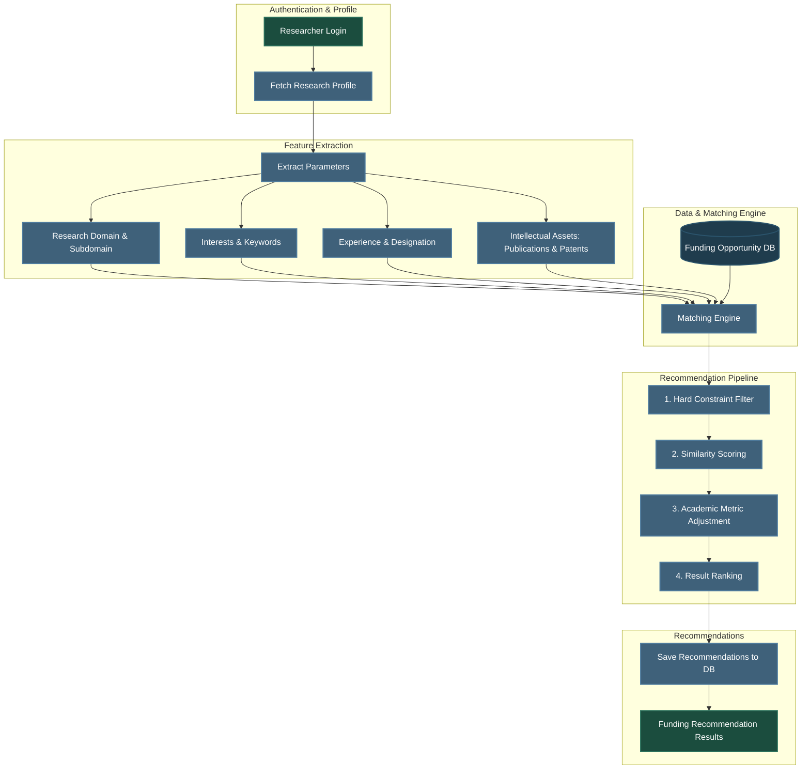
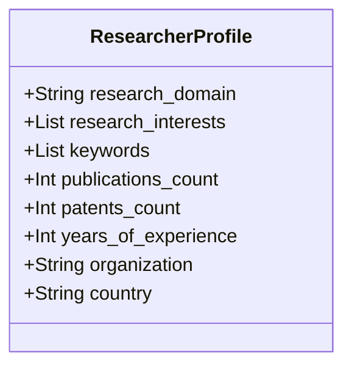

# Funding Recommendation Engine Design

This document details the architecture, workflows, data schemas, and matching inputs designed for the **Funding Recommendation Engine** on the Research Funding & Innovation Intelligence Platform. 

---

## 1. System Overview

The **Funding Recommendation Engine** is an intelligence subsystem designed to autonomously match researchers and innovators with relevant global funding opportunities. It processes unstructured and structured profile parameters—such as domains, interest keywords, publication history, patents, and years of experience—and matches them against a curated database of active grants and call-for-proposals.

### Core Objectives
1. **Automated Personalization**: Recommend opportunities relevant to the researcher's active topics, career level, and institutional standing.
2. **Explainability**: Provide clear, data-driven rationales for each recommendation (e.g., indicating keyword matches, domain alignment, or eligibility compliance).
3. **Continuous Feedback**: Track recommendation acceptance, dismissal, and submission statuses to feed reinforcement loops for future iterations.

---

## 2. Recommendation Engine Workflow

The recommendation pipeline progresses from user authentication to profile extraction, database querying, matching evaluation, scoring, and output ranking.

### Workflow Sequence



---

## 3. Database Schema

The user-requested schema structure represents a flat representation of a funding opportunity. To maintain compatibility with the normalized PostgreSQL structure established in Milestone 1, this section presents both the direct flat schema and the relational normalization strategy.

### Flat Table Schema (`funding_opportunities_flat`)

| Field Name | Data Type | Constraint | Description |
| :--- | :--- | :--- | :--- |
| `funding_id` | `UUID` | `PRIMARY KEY`, `DEFAULT gen_random_uuid()` | Unique identifier for the funding opportunity. |
| `funding_title` | `VARCHAR(255)` | `NOT NULL` | Title of the grant or call-for-proposals. |
| `funding_agency` | `VARCHAR(255)` | `NOT NULL` | The sponsoring organization or agency (e.g., NSF, NIH). |
| `funding_type` | `VARCHAR(100)` | `NOT NULL` | Type of call (e.g., Fellowship, Research Grant, Startup Award). |
| `research_domains` | `TEXT[]` / `JSONB` | `NOT NULL` | Array of scientific domains eligible (e.g., `["Robotics", "AI"]`). |
| `keywords` | `TEXT[]` / `JSONB` | `NOT NULL` | Related technology or study keywords for keyword matching. |
| `eligibility` | `TEXT` | `NULL` | Detailed narrative eligibility criteria. |
| `funding_amount` | `NUMERIC(15,2)`| `CHECK (funding_amount >= 0)` | Maximum grant amount awarded. |
| `application_deadline` | `TIMESTAMP` | `NULL` | Date and time by which applications must be submitted. |
| `country` | `VARCHAR(100)` | `NOT NULL` | Host country of funding body or eligibility restriction. |
| `duration` | `VARCHAR(50)` | `NULL` | Estimated period of performance (e.g., "3 Years", "12 Months"). |
| `description` | `TEXT` | `NOT NULL` | Deep description of the opportunity scope. |
| `application_url` | `VARCHAR(500)` | `NULL` | Link to the official grant portal page. |
| `status` | `VARCHAR(50)` | `DEFAULT 'OPEN'` | Status indicator (`OPEN`, `CLOSED`, `ARCHIVED`). |
| `created_at` | `TIMESTAMP` | `DEFAULT CURRENT_TIMESTAMP` | Internal creation timestamp. |

### DDL Implementation Script

```sql
CREATE TABLE funding_opportunities_flat (
    funding_id UUID PRIMARY KEY DEFAULT gen_random_uuid(),
    funding_title VARCHAR(255) NOT NULL,
    funding_agency VARCHAR(255) NOT NULL,
    funding_type VARCHAR(100) NOT NULL,
    research_domains JSONB NOT NULL, -- structured domains
    keywords JSONB NOT NULL,         -- matching terms
    eligibility TEXT,
    funding_amount NUMERIC(15,2) CHECK (funding_amount >= 0),
    application_deadline TIMESTAMP WITH TIME ZONE,
    country VARCHAR(100) NOT NULL,
    duration VARCHAR(50),
    description TEXT NOT NULL,
    application_url VARCHAR(500),
    status VARCHAR(50) DEFAULT 'OPEN' CHECK (status IN ('OPEN', 'CLOSED', 'ARCHIVED')),
    created_at TIMESTAMP WITH TIME ZONE DEFAULT CURRENT_TIMESTAMP,
    updated_at TIMESTAMP WITH TIME ZONE DEFAULT CURRENT_TIMESTAMP
);
```

---

## 4. Matching Engine Inputs

The Matching Engine utilizes two main groups of parameters: **Researcher Attributes** (derived from the profile, publications, and patents) and **Funding Attributes** (derived from the funding opportunity database).

### Researcher Input Parameters



- **Research Domain**: Primary discipline (e.g., "Computer Science", "Biomedicine") used for coarse filtering.
- **Research Interests**: Dynamic list of high-level interests (e.g., "Deep Learning", "Gene Editing").
- **Keywords**: Fine-grained matching tokens extracted from publications, profile setup, and active patents.
- **Publications Count**: Numeric proxy for academic track record, establishing suitability for senior or research-heavy fellowships.
- **Patents Count**: Numeric proxy for translation capacity, linking researchers with industrial or startup grants.
- **Years of Experience**: Numerical duration in research roles, indicating career status (e.g., early-career, mid-career, senior).
- **Organization**: Host institution type (e.g., university, national laboratory, private startup).
- **Country**: Geographic residence or operations base, matching host limitations.

---

## 5. Future Recommendation Logic

Once implemented, the Matching Engine will compute a match score using a hybrid recommendation algorithm combining strict filtering (rules-based) with numeric similarity metrics.

### Stage 1: Hard Filtering (Constraints check)
Before running advanced matching, opportunities that fail basic criteria are immediately culled:
1. **Geographic Eligibility**: If the opportunity requires researchers to reside in the `US` and the researcher's country is `FR`, exclude it.
2. **Career Phase Check**: If years of experience exceed the maximum allowed for a postdoctoral fellowship (e.g., max 5 years) or are below the minimum required for senior PIs, exclude it.
3. **Status Check**: Exclude grants that are `CLOSED` or `ARCHIVED`.

### Stage 2: Soft Matching (Similarity Scoring)

Once filters are passed, a composite score is computed using the following components:

#### A. Keyword Overlap (Jaccard Similarity)
Measures vocabulary overlap between researcher keywords ($K_R$) and grant opportunity keywords ($K_O$):
$$\text{Score}_{\text{Jaccard}} = \frac{|K_R \cap K_O|}{|K_R \cup K_O|}$$

#### B. Semantic Similarity
Uses a neural embedding model (e.g., SentenceTransformers) to compute cosine similarity between the text embeddings of:
- **Researcher Text**: Concatenation of primary domain, subdomains, biography, and publications titles.
- **Funding Text**: Concatenation of title, description, and eligibility criteria.
$$\text{Score}_{\text{Semantic}} = \cos(\mathbf{E}_{\text{Researcher}}, \mathbf{E}_{\text{Funding}}) = \frac{\mathbf{E}_{\text{Researcher}} \cdot \mathbf{E}_{\text{Funding}}}{\|\mathbf{E}_{\text{Researcher}}\| \|\mathbf{E}_{\text{Funding}}\|}$$

#### C. Weight Distribution
The final match score will be calculated as a weighted sum of the parameters:

```text
Score = (0.30 × Domain Match) 
      + (0.35 × Semantic Similarity) 
      + (0.15 × Jaccard Keyword Overlap) 
      + (0.10 × Experience/Career Level Alignment) 
      + (0.10 × Academic/IP Performance Boost)
```

- **Academic/IP Performance Boost**: A logarithmic multiplier based on publication and patent counts, amplifying matches for highly active innovators applying to research-intensive calls.

---

## 6. Folder Structure for Milestone 2

The project folder structure remains consistent with Milestone 1. New services, models, schemas, and routes for Milestone 2 are introduced as logical additions to their respective directories.

```text
Research-Funding-Innovation-Intelligence-Platform/
│
├── backend/
│   ├── app/
│   │   ├── database/        # Connection managers
│   │   ├── models/          # SQLAlchemy Database Models
│   │   │   ├── user.py
│   │   │   ├── profile.py
│   │   │   ├── publication.py
│   │   │   ├── patent.py
│   │   │   └── funding.py   # [NEW] SQLAlchemy Funding & Agency models (planned)
│   │   │
│   │   ├── routes/          # API Endpoints / Routers
│   │   │   ├── auth.py
│   │   │   ├── profile.py
│   │   │   ├── publication.py
│   │   │   ├── patent.py
│   │   │   └── funding.py   # [NEW] Funding match and query routes (planned)
│   │   │
│   │   ├── schemas/         # Pydantic Validation Schemas
│   │   │   ├── profile.py
│   │   │   ├── publication.py
│   │   │   ├── patent.py
│   │   │   └── funding.py   # [NEW] Funding Pydantic schemas (planned)
│   │   │
│   │   ├── services/        # Business Logic Services
│   │   │   ├── auth_service.py
│   │   │   ├── profile_service.py
│   │   │   ├── publication_service.py
│   │   │   ├── patent_service.py
│   │   │   └── funding_service.py # [NEW] Skeleton matching service (Milestone 2)
│   │   │
│   │   ├── utils/           # Security & JWT Helpers
│   │   └── main.py          # FastAPI application startup init
│   │
│   ├── requirements.txt     # Python Dependencies
│   ├── verify_auth.py
│   ├── verify_profile.py
│   ├── verify_publication.py
│   ├── verify_patent.py
│   └── verify_full_flow.py
│
├── frontend/                # React App Scaffold
│
├── database/                # SQL Schema scripts
│
└── docs/
    ├── database/            # Database schema documentation
    ├── ui_wireframes/       # UI flow map, navigation trees, and PNG wireframes
    ├── reports/             # Milestone progress reports
    └── funding_engine_design.md # [NEW] Milestone 2 Design Doc
```

---

## 7. Next Steps for Implementation

1. **Database Integration**: Translate the designed SQL schema into Python/SQLAlchemy models in `backend/app/models/funding.py`.
2. **Mock Data Generation**: Create sample global grants (e.g., Horizon Europe, NIH R01, NSF Career Awards) to populate the database during tests.
3. **matching_service Development**: Integrate TF-IDF or text embedding models to implement the math similarity scoring details defined above.
4. **API Route Exposure**: Add endpoint `GET /funding/recommendations` returning ranked matches.
