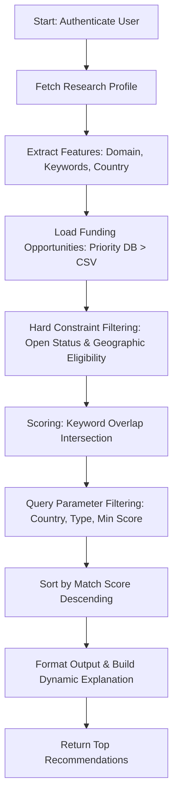

# Funding Opportunity Recommendations

This document describes the design, implementation, matching workflows, and API specifications for the Funding Opportunity Recommendation module.

---

## 1. Module Overview
The recommendation module provides personalized, ranked, and explainable grant opportunity matches for authenticated researchers. By querying their user profile (interests, keywords, and domain), the system applies soft matching rules and hard constraints against the global funding opportunities database to return high-probability recommendations.

---

## 2. Ingestion Order & Priority
To support robust data retrieval across development and production environments, dataset loading follows an explicit fallback order:
1.  **Priority 1 (Database)**: Load funding opportunities directly from the PostgreSQL `funding_opportunities` table.
2.  **Priority 2 (Processed CSV)**: If the database table is empty or unavailable, fall back to parsing [funding_processed.csv](file:///c:/Users/Admin/OneDrive/Desktop/ATM/Research-Funding-Innovation-Intelligence-Platform/datasets/processed/funding/funding_processed.csv).

---

## 3. Matching & Recommendation Workflow

The matching pipeline executes the following sequence:



### A. Dynamic Recommendation Reason
For each recommended opportunity, a friendly match explanation is constructed detailing the criteria overlap:
```text
Matched because:
• Research Domain: {Domain Name} (Aligned/Unmatched)
• Keyword Match: {Matched Keyword List}
• Eligibility: Country Eligible ({Country Code})
• Funding Type: {Funding Type}
```

---

## 4. API Specification

### Expose Endpoint
*   **Path**: `/funding/recommendations`
*   **Method**: `GET`
*   **Security**: Requires a valid JWT access token in the `Authorization` header.

### Request Query Parameters
*   `country` (string, optional) - Filter results by specific country limits (e.g. `US`, `EU`, `Global`).
*   `funding_type` (string, optional) - Filter by type (e.g., `Grant`, `Fellowship`, `Contract`).
*   `minimum_match_score` (float, optional) - Minimum threshold (accepts both `0.0`-`1.0` and `0.0`-`100.0` scales).
*   `limit` (integer, optional) - Limits recommendations count (default is 10).

### Response Schema

```json
{
  "recommendations": [
    {
      "funding_id": "8d38ad9b-9c7f-4318-ae26-fcf99e52e46b",
      "title": "Scalable Neural Networks for Autonomous Robotics",
      "funding_agency": "National Science Foundation",
      "research_domain": "Artificial Intelligence",
      "funding_amount": 150000.0,
      "funding_type": "Grant",
      "country": "US",
      "application_deadline": "2026-12-31T00:00:00Z",
      "deadline": "2026-12-31T00:00:00Z",
      "match_score": 80.0,
      "recommendation_reason": "Matched because: • Research Domain: Artificial Intelligence (Aligned) • Keyword Match: neural networks, machine learning • Eligibility: Country Eligible (US) • Funding Type: Grant"
    }
  ]
}
```

---

## 5. Future AI Enhancements
While the current engine uses a rule-based keyword intersection count, future updates will incorporate:
*   **Jaccard Similarity**: Weighted index measuring keyword dictionary overlap.
*   **Cosine Semantic Similarity**: Comparing sentence-transformer text embeddings of the researcher's biography/interests against grant solicitations descriptions.
*   **Vector DB Indexes**: Utilizing vector indexes for sub-millisecond semantic search.
*   **Collaborator Recommender**: Expanding recommendations to identify co-PI matching profiles.
