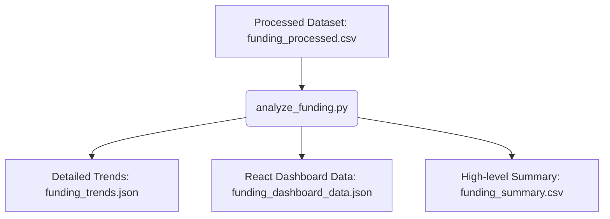

# Funding Trend Analysis Module

## Overview
The Funding Trend Analysis module provides backend analytical capabilities to compute trends, research domain averages, funding agency standings, funding type distributions, and deadline timelines from the processed funding opportunities dataset. These pre-calculated trends enable visual components inside the Research Intelligence Dashboard to load instantly.

---

## Workflow
The funding opportunities pipeline operates as follows:



1. **Ingestion**: Reads the processed opportunity dataset from `datasets/processed/funding/funding_processed.csv`.
2. **Analysis**: Groups opportunities, extracts timelines, calculates dollar statistics, and aggregates keyword counts.
3. **Data Sanitization**: Excludes data placeholders such as `"Unknown Agency"`, `"Unknown Country"`, and `"No Keywords"` to prevent skewed results.
4. **Serialization**: Saves results in detailed JSON, chart-friendly JSON, and flat CSV formats.

---

## Generated Analytics

### 1. Funding Opportunities per Application Year
- Grouped count of opportunities based on their application deadline year.
- Extracted using the first 4 characters of `application_deadline`.

### 2. Chronological Application Deadline Timeline
- Tracks deadlines over time, including:
  - **Year-over-Year Growth Rate**: Growth percentage `((Current - Prev) / Prev) * 100`. If previous year count is 0, growth is set to `null` to avoid zero-division errors.
  - **Average Growth Rate**: Mean growth percentage across all transitions.
  - **Trend Classification**: Automatically classifies overall trend as `"Increasing"` (average growth > 5%), `"Declining"` (average growth < -5%), or `"Stable"` (otherwise).

### 3. Funding Opportunities by Research Domain
- Opportunities count across 25 research domains.

### 4. Funding Type Distribution
- Breakdown of opportunities by type (e.g., *Grant*, *Contract*, *Award*, *Cooperative Agreement*, *Fellowship*).

### 5. Country Distribution
- Opportunities grouped by country of jurisdiction (excluding `"Unknown Country"`).

### 6. Funding Amount Statistics
- Cumulative analytics computed directly from the numerical `funding_amount` values:
  - **Total Funding Amount**: Sum of all opportunities.
  - **Average Funding Amount**: Mean opportunity amount.
  - **Maximum Funding Amount**: Largest single opportunity amount.
  - **Minimum Funding Amount**: Lowest opportunity amount.

### 7. Average Funding Amount per Research Domain
- Computes the mean opportunity amount within each scientific domain to identify research domains attracting the highest funding values.

### 8. Top 20 Keywords
- Frequent terms extracted from comma-separated keywords list, excluding `"No Keywords"`.

### 9. Dataset Summary
- Metrics:
  - Total opportunities count.
  - Unique funding agencies count (excluding `"Unknown Agency"`).
  - List of research domains covered.
  - List of funding types covered.
  - List of countries covered.
  - Publication years range covered (min and max years, excluding year `0`).

---

## Output Files

Output files are stored under `datasets/analytics/`:

### 1. `funding_trends.json`
Contains a structured, nested JSON object of all calculated analytics.
- **Use Case**: Detailed backend data retrieval, REST API payloads, and general funding audits.
- **Format**:
  ```json
  {
    "funding_opportunities_per_year": { "2026": 2767, "2027": 2233 },
    "application_deadline_timeline": {
      "timeline": [ { "year": 2026, "opportunities": 2767, "growth_percentage": null }, ... ],
      "average_growth_rate": -19.3,
      "trend": "Declining"
    },
    "funding_opportunities_by_domain": { "Electrical Engineering": 200, ... },
    "funding_type_distribution": { "Grant": 1019, ... },
    "country_distribution": { ... },
    "funding_amount_statistics": { "total_funding_amount": 5150564000.0, ... },
    "average_funding_amount_per_domain": { ... },
    "top_funding_agencies": { ... },
    ...
  }
  ```

### 2. `funding_dashboard_data.json`
Chart-friendly JSON layout where keys are structured as arrays of objects.
- **Use Case**: Direct mapping into charting libraries (e.g. Recharts, Chart.js) inside the React frontend.
- **Format**:
  ```json
  {
    "application_deadline_timeline": {
      "timeline": [ { "year": 2026, "opportunities": 2767, "growth_percentage": null }, ... ],
      "average_growth_rate": -19.3,
      "trend": "Declining"
    },
    "funding_opportunities_by_domain": [ { "domain": "Electrical Engineering", "opportunities": 200 }, ... ],
    ...
  }
  ```

### 3. `funding_summary.csv`
A simple key-value flat file representing the dataset's high-level summary metrics.
- **Use Case**: Reporting, quick human inspection, and business intelligence exports.
- **Format**:
  ```csv
  Metric,Value
  Total Funding Opportunities,5000
  Unique Funding Agencies,9
  Start Year,2026
  End Year,2027
  Total Research Domains,25
  Total Funding Types,5
  Total Countries Covered,6
  ```

---

## Dashboard Integration
For dashboard deployment:
- **Timeline Visualization**: Render `application_deadline_timeline` as a **Line/Bar Chart** representing the upcoming funding deadline landscape, showing YoY changes and a **Trend Badge** (`Declining`, `Increasing`, `Stable`).
- **Domain Distribution**: Render `funding_opportunities_by_domain` and `average_funding_amount_per_domain` as **Horizontal Bar Charts** showing opportunities volume and funding values per research domain.
- **Funding Types & Countries**: Render `funding_type_distribution` and `country_distribution` as **Pie/Donut Charts** showing funding type partition.
- **Agency Leaderboard**: Render `top_funding_agencies` as a **Leaderboard Table**.
- **Scorecards**: Map `funding_amount_statistics` and `summary_metrics` to high-level cards showing Total Opportunities, Unique Agencies, Total Funding Value, and Average Grant Amount.

---

## Future Recommendation Engine Integration
The calculated domain distributions and average funding amounts provide essential statistical baselines.
When matching researchers to funding opportunities, the Recommendation Engine can:
1. Cross-reference the researcher's domain with the **Average Funding Amount per Domain** to weigh recommendations.
2. Filter out opportunities below the statistical average if a researcher holds high academic standing (e.g. senior researchers match larger grants).
3. Use the timeline deadlines to prioritize recommendations approaching their deadline dates.
