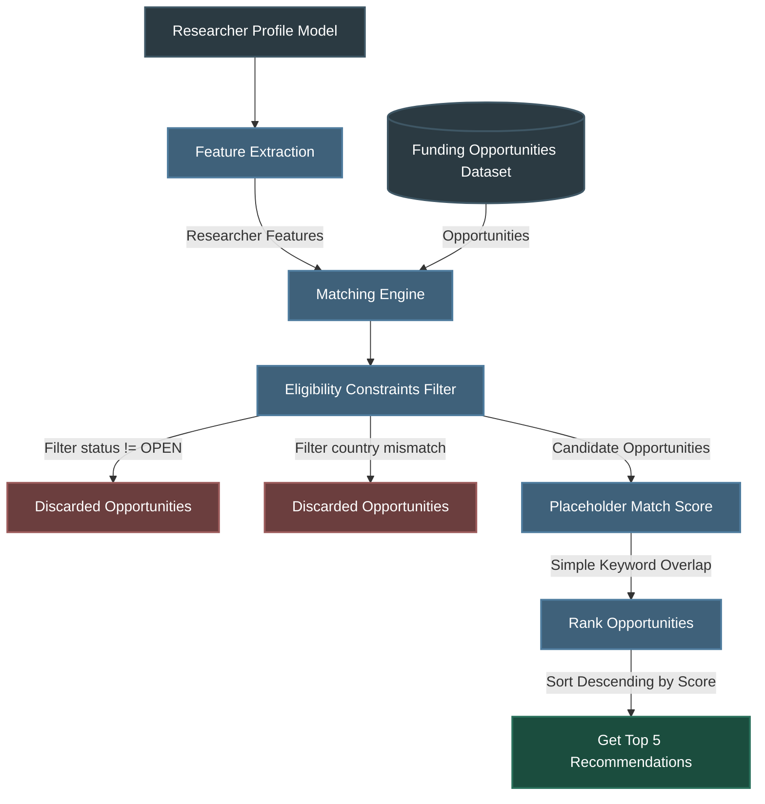

# Grant Matching Workflow

This document details the backend architectural design, workflows, inputs, filtering mechanisms, and future AI similarity modeling designed for the **Grant Matching Subsystem** of the Research Funding & Innovation Intelligence Platform.

---

## 1. Workflow Overview

The Grant Matching Workflow is responsible for mapping a researcher's academic and intellectual property (IP) profile to active funding opportunities. It processes structured profile data, publication metrics, and patent history to match and rank grant calls.

### Pipeline execution flow:

```text
       Research Profile
               │
               ▼
       Feature Extraction
               │
               ▼
        Funding Dataset
               │
               ▼
       Eligibility Filter
               │
               ▼
     Candidate Opportunities
               │
               ▼
     Placeholder Match Score
               │
               ▼
            Ranking
               │
               ▼
       Top Recommendations
```

---

## 2. Mermaid Workflow Diagram

The technical sequence of matching events within the backend service layer is visualized below:



---

## 3. Ingestion & Matching Attributes

The subsystem compares a specific schema of researcher features against corresponding opportunities properties.

### Researcher Input Attributes (Profile Features)
* **Research Domain**: Coarse-grained scientific discipline (e.g. `Artificial Intelligence`, `Biotechnology`) used for broad subject alignment.
* **Keywords**: Fine-grained technical terms derived from publications, patents, or manual profile setup.
* **Research Interests**: Broad research topics of focus declared by the user (e.g. `deep learning`, `CRISPR`).
* **Publications Count**: Count of historical publications, reflecting academic research productivity.
* **Patents Count**: Count of active or granted patents, acting as a proxy for technology translation capacity.
* **Years of Experience**: Years of active research, matching career stage eligibility (e.g. early-career, senior investigator).
* **Organization**: Researcher's affiliated university, research institute, or private company.
* **Country**: Researcher's primary geographic location (e.g. `US`, `EU`, `GB`) to test against geo-restrictions.

### Funding Target Attributes (Opportunity Schema)
* **Research Domain**: Primary domain of the grant call.
* **Keywords**: Targeted technical concepts associated with the opportunity.
* **Eligibility**: Eligibility descriptions indicating restrictions (e.g. postdoctoral status, non-profit institutions).
* **Country**: Host or geographical restrictions indicating which countries' institutions are eligible.
* **Funding Type**: Call classification (e.g. `Grant`, `Fellowship`, `Contract`, `Award`).
* **Funding Amount**: The financial value (e.g. 500,000) for budget alignment check.
* **Deadline**: Date of application closing, representing urgency.

---

## 4. Hard Constraints Filtering Strategy

To minimize computational overhead before executing similarity matches, opportunities are passed through hard-filtering rules. Any opportunity failing the following criteria is immediately culled:

1. **Status Verification**: Opportunities must have an active status of `OPEN`. Calls marked `CLOSED` or `ARCHIVED` are discarded.
2. **Geographical Eligibility**: If the funding opportunity has an explicit country restriction (e.g. `US`, `EU`, `GB`) and the researcher's extracted country is different, the opportunity is excluded. Opportunities classified as `Global` bypass this check.

---

## 5. Ranking Strategy (Placeholder Logic)

The ranking engine currently uses a **simple keyword overlap count** to establish a placeholder match score, ensuring clean execution flow during current development phases:

* **Placeholder Scoring**: Computes the size of the intersection between researcher keywords and funding opportunity keywords.
* **Formula**:
  $$\text{Score} = \min(1.0, |K_R \cap K_O| \times 0.1)$$
* **Sorting**: Opportunities passing the hard constraints are sorted descending by the computed placeholder score.
* **Cap**: The final output slice limits matching recommendations to the top 5 results.

---

## 6. Future AI Matching Logic

In future releases of the platform, the placeholder match score will be replaced by a hybrid recommendation model executing semantic vector similarity and career-level weighting:

### Neural Text Embeddings
* **Cosine Similarity**: Cosine similarity calculations will be computed on dense embeddings representing text inputs:
  $$\text{Score}_{\text{Semantic}} = \cos(\mathbf{E}_{\text{Profile}}, \mathbf{E}_{\text{Opportunity}})$$
  where $\mathbf{E}_{\text{Profile}}$ represents embeddings from biography, interests, and publications, and $\mathbf{E}_{\text{Opportunity}}$ represents embeddings from the grant title and description text.

### Weighted Recommendation Formula
```text
Score = (0.30 × Domain Match) 
      + (0.35 × Semantic Cosine Similarity) 
      + (0.15 × Jaccard Keyword Overlap) 
      + (0.10 × Experience/Career Level Alignment) 
      + (0.10 × Academic/IP Performance Boost)
```
* **Jaccard Keyword Overlap**: Ratio of keyword intersection over keyword union.
* **Experience Alignment**: Numerical penalty or validation matching researcher's years of experience against fellowship or senior grant requirements.
* **Academic/IP Performance Boost**: A logarithmic scaling function leveraging publications and patents counts to boost match values for highly productive investigators:
  $$\text{Boost} = \min\left(1.0, w_1 \cdot \ln(1 + \text{Publications}) + w_2 \cdot \ln(1 + \text{Patents})\right)$$
