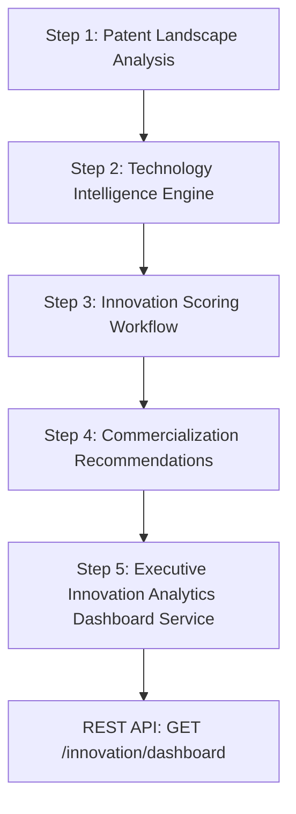

# Innovation Analytics Dashboard System Documentation (Step 5)

## Overview & Executive Purpose
The **Innovation Analytics Dashboard** serves as the central executive decision-support system of the Research Funding & Innovation Intelligence Platform. It aggregates intelligence outputs from four core domain engines:
1. **Patent Landscape Analysis (Step 1)**
2. **Technology Intelligence Engine (Step 2)**
3. **Innovation Scoring Workflow (Step 3)**
4. **Commercialization Recommendations (Step 4)**

Rather than duplicating complex calculation algorithms, the dashboard service acts as an aggregation and orchestration layer. It exposes a unified, JWT-protected REST API endpoint (`GET /innovation/dashboard`) with Role-Based Access Control (RBAC) and real-time health metadata.

---

## 5-Tier Architecture & Dependency Cascade

The dashboard service automatically resolves missing inputs by triggering upstream analytics modules in dependency order:



### Dependency Resolution Workflow
1. Checks for `commercialization_dashboard.json`. If missing, triggers `analyze_commercialization_recommendations.py`.
2. `analyze_commercialization_recommendations.py` checks for `innovation_scores.json`. If missing, triggers `analyze_innovation_scoring.py`.
3. `analyze_innovation_scoring.py` checks for `technology_intelligence.json`. If missing, triggers `analyze_technology_intelligence.py`.
4. `analyze_technology_intelligence.py` checks for `patent_landscape.json`. If missing, triggers `analyze_patent_landscape.py`.

---

## Role-Based Dashboard Views (RBAC)

To tailor actionable intelligence to specific user personas, the API dynamically structures the response payload based on the user's role:

| Role | Accessible Sections | Primary Focus |
| :--- | :--- | :--- |
| **Researcher** | `summary`, `metadata`, `technology_intelligence`, `innovation_scores` | Academic trends, technology maturity, domain momentum & research scoring |
| **Startup Founder** | `summary`, `metadata`, `patent_landscape`, `commercialization`, `innovation_scores` | IP positioning, market opportunity, investment priorities, commercialization pathways |
| **Innovation Manager** | `summary`, `metadata`, `patent_landscape`, `technology_intelligence`, `innovation_scores`, `commercialization` | Full executive decision support across technology, IP, scoring, and transfer strategies |
| **Administrator** | Complete Dashboard + System Health Audit | Complete executive analytics and background system state |

---

## Health Metadata Specification

Every API response includes a top-level `metadata` object enabling frontends to immediately audit system health:

```json
"metadata": {
  "dashboard_version": "1.0",
  "generated_at": "2026-08-05T20:38:00+05:30",
  "analytics_status": "Healthy",
  "modules_loaded": 4
}
```

---

## Executive KPI Definitions

- **Total Technology Domains**: Count of all evaluated technology fields (e.g., 25 domains).
- **Emerging Technologies**: Count of domains classified in the early growth lifecycle.
- **Growing / Mature / Declining Technologies**: Count of domains at respective lifecycle stages.
- **High Momentum Technologies**: Domains exhibiting top-tier annual publication and filing velocity.
- **Commercialization Ready**: Technologies meeting readiness thresholds ($\ge 65/100$) for licensing or spinoff deployment.
- **Immediate Investment**: Technologies identified with top investment priority scores.
- **Average Innovation Score**: Mean composite score across all domains.
- **Average Opportunity Score**: Mean market opportunity index.
- **Average Commercialization Readiness**: Mean readiness rating.
- **Average Risk Score**: Mean technology risk index ($100 - \text{Innovation Score}$).

---

## REST API Specification

### Endpoint
`GET /innovation/dashboard`

### Security
Requires HTTP Bearer JWT Authentication (`Authorization: Bearer <access_token>`).

### Example Response (Innovation Manager / Admin)
```json
{
  "summary": {
    "total_domains": 25,
    "emerging": 1,
    "growing": 0,
    "mature": 2,
    "declining": 22,
    "high_momentum": 0,
    "commercialization_ready": 2,
    "immediate_investment": 0,
    "strategic_monitoring": 2,
    "average_innovation_score": 43.5,
    "average_opportunity_score": 38.6,
    "average_commercialization_readiness": 48.2,
    "average_risk_score": 56.5,
    "last_updated": "2026-08-05T20:38:00+05:30"
  },
  "metadata": {
    "dashboard_version": "1.0",
    "generated_at": "2026-08-05T20:38:00+05:30",
    "analytics_status": "Healthy",
    "modules_loaded": 4
  },
  "patent_landscape": { ... },
  "technology_intelligence": { ... },
  "innovation_scores": { ... },
  "commercialization": { ... }
}
```

---

## Future Extensions
1. **AI Time-Series Forecasting**: Machine learning models predicting patent filing acceleration 3-5 years into the future.
2. **Predictive Commercialization**: Automated valuation models estimating licensing deal size and spinoff ROI.
3. **Technology Investment Advisor**: Real-time portfolio rebalancing advisor suggesting grant funding allocations.
