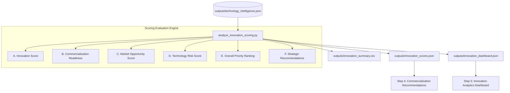

# Innovation Scoring Workflow — Documentation

## Module Architecture & Overview

The **Innovation Scoring Workflow** (Step 3) synthesizes the structured outputs from Step 1 (**Patent Landscape Analysis**) and Step 2 (**Technology Intelligence Engine**) into standardized, multi-dimensional quantitative scores for every technology domain.

The scoring model evaluates 5 core dimensions:
1. **Innovation Score**: Measures raw technical velocity, maturity tier, convergence strength, and patent volume.
2. **Commercialization Readiness Score**: Evaluates adoption stage, maturity stage, industry participation, and assignee breadth.
3. **Market Opportunity Score**: Assesses geographic spread, YoY filing growth rate, and emerging technology demand.
4. **Technology Risk Score**: Measures filing contraction, weak momentum, and low assignee participation.
5. **Overall Innovation Priority**: A composite weighted priority score combining all 4 dimensions into a single overall score ($0 - 100$), rank, and investment action category.

---

## Workflow Diagram



---

## Scoring Methodology & Weighting Formulas

### 1. Innovation Score (0–100)
Evaluates innovation activity and convergence strength:

$$\text{Innovation Score} = (0.35 \times S_{\text{momentum}}) + (0.25 \times S_{\text{maturity}}) + (0.20 \times S_{\text{convergence}}) + (0.15 \times S_{\text{volume}}) + (0.05 \times S_{\text{emerging\_bonus}})$$

- **Classifications**: `Excellent` ($\ge 85.0$), `Strong` ($70.0 - 84.9$), `Moderate` ($50.0 - 69.9$), `Weak` ($< 50.0$).

### 2. Commercialization Readiness Score (0–100)
Measures market deployment readiness:

$$\text{Readiness Score} = (0.40 \times S_{\text{mat\_readiness}}) + (0.35 \times S_{\text{adoption\_stage}}) + (0.25 \times S_{\text{assignee\_participation}})$$

- **Classifications**: `Ready` ($\ge 80.0$), `Nearly Ready` ($65.0 - 79.9$), `Developing` ($50.0 - 64.9$), `Early Research` ($< 50.0$).

### 3. Market Opportunity Score (0–100)
Evaluates growth trajectory and global market demand:

$$\text{Market Opportunity Score} = (0.40 \times S_{\text{growth\_factor}}) + (0.35 \times S_{\text{geo\_spread}}) + (0.25 \times S_{\text{emerging\_velocity}})$$

- **Classifications**: `Very High` ($\ge 80.0$), `High` ($65.0 - 79.9$), `Medium` ($45.0 - 64.9$), `Low` ($< 45.0$).

### 4. Technology Risk Score (0–100)
Measures market and technology risk:

$$\text{Risk Score} = (0.40 \times R_{\text{contraction}}) + (0.35 \times (100 - S_{\text{momentum}})) + (0.25 \times R_{\text{low\_participation}})$$

- **Classifications**: `Low Risk` ($< 35.0$), `Moderate Risk` ($35.0 - 65.0$), `High Risk` ($> 65.0$).

### 5. Overall Innovation Priority Score (0–100)
Weighted aggregate formula specified for portfolio ranking:

$$\text{Overall Score} = (0.35 \times \text{InnovationScore}) + (0.25 \times \text{ReadinessScore}) + (0.25 \times \text{OpportunityScore}) + (0.15 \times (100 - \text{RiskScore}))$$

- **Investment Categories**:
  - `Immediate Investment` ($\ge 80.0$)
  - `Strategic Monitoring` ($65.0 - 79.9$)
  - `Future Research` ($50.0 - 64.9$)
  - `Low Priority` ($< 50.0$)

---

## Output Schemas

### 1. `backend/outputs/innovation_scores.json`
Complete structured JSON output:

```json
{
  "metadata": {
    "total_domains_scored": 25,
    "top_priority_domain": "Artificial Intelligence",
    "immediate_investment_count": 8,
    "workflow_status": "Active"
  },
  "innovation_scores": {
    "Artificial Intelligence": {
      "score": 88.5,
      "classification": "Excellent",
      "components": {
        "momentum_score": 78.4,
        "maturity_score": 95.0,
        "convergence_strength": 85.0,
        "patent_volume_score": 100.0,
        "emerging_bonus": 10.0
      }
    }
  },
  "commercialization_readiness": {
    "Artificial Intelligence": {
      "score": 82.5,
      "classification": "Ready"
    }
  },
  "market_opportunities": {
    "Artificial Intelligence": {
      "score": 85.0,
      "opportunity_level": "Very High"
    }
  },
  "technology_risk": {
    "Artificial Intelligence": {
      "score": 22.5,
      "risk_level": "Low Risk"
    }
  },
  "priority_rankings": {
    "Artificial Intelligence": {
      "overall_score": 84.5,
      "priority_rank": 1,
      "investment_category": "Immediate Investment"
    }
  },
  "strategic_recommendations": {
    "Artificial Intelligence": {
      "overall_score": 84.5,
      "priority_rank": 1,
      "category": "Immediate Investment",
      "recommendation": "Immediate Investment — High commercialization readiness and market demand."
    }
  }
}
```

### 2. `backend/outputs/innovation_dashboard.json`
Payload structured for UI visualization (summary KPIs, priority leaderboard, 4-quadrant risk vs. opportunity matrix, radar chart metrics).

### 3. `backend/outputs/innovation_summary.csv`
CSV headers:
`Technology Domain`, `Innovation Score`, `Readiness Score`, `Opportunity Score`, `Risk Score`, `Overall Score`, `Priority Rank`, `Recommendation`

---

## Downstream Foundation (Step 4 & Step 5)

1. **Commercialization Recommendations (Step 4)**:
   - Uses `readiness_score`, `risk_score`, and `investment_category` to match IP assets with corporate partners, licensing strategies, and spin-off opportunities.
2. **Innovation Analytics Dashboard (Step 5)**:
   - Ingests `innovation_dashboard.json` directly into frontend React components (Radar charts, Priority leaderboard, Risk-Opportunity scatter plots).
