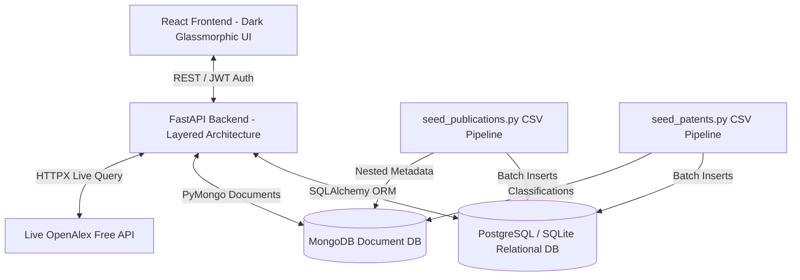

# AI Research Funding & Innovation Intelligence Platform
## Milestone 1: Core Architecture, Database Schema, & Dataset Integration

---

## 1. Project Objectives & Workflow

The **AI Research Funding & Innovation Intelligence Platform** bridges the gap between academic research, patent innovation, and funding opportunities. Milestone 1 establishes the production-grade foundation, enabling:
- **Multi-Persona Access**: Role-Based Access Control (RBAC) supporting **Researchers**, **Startup Founders**, **Innovation Managers**, and **Administrators**.
- **Research Profile Intelligence**: Comprehensive management of researcher profiles, domains, keywords, and linked intellectual property.
- **Hybrid Data Pipeline**: Structured relational storage in PostgreSQL paired with flexible document storage in MongoDB for variable-schema scientific metadata and patent classifications.
- **Real-World Dataset Ingestion**: Fast, resilient CSV bulk ingestion pipelines for academic publications (arXiv) and patent records (USPTO), alongside live OpenAlex API integration.

---

## 2. System Architecture & Layered Backend

The backend follows a strict 4-layer architecture to ensure clean separation of concerns and maintainability:
1. **Routers Layer (`app/routers/`)**: Handles HTTP requests, authentication guards, status codes, and delegates logic to services.
2. **Services Layer (`app/services/`)**: Encapsulates business logic, external API calls (`openalex_client.py`), and ingestion pipelines (`ingestion_service.py`).
3. **Data Access Layer (`app/models/` & `app/core/database.py`)**: SQLAlchemy ORM models and PyMongo database client.
4. **Data Transfer & Validation Layer (`app/schemas/`)**: Pydantic v2 schemas providing runtime input validation and structured responses.

---

## 3. Database Schema Design

### PostgreSQL Relational Schema
- **`users`**: Authentication credentials and role definitions (`Researcher`, `Startup Founder`, `Innovation Manager`, `Administrator`).
- **`research_profiles`**: Researcher biographical data, organization affiliation, domain expertise, h-index metrics, and linked assets.
- **`publications`**: Normalized academic papers with external IDs, titles, abstracts, publication date, citation metrics, and structured JSON fields for authors and categories.
- **`patents`**: USPTO patent records with patent number, title, abstract, assignee, filing date, citation metrics, and structured JSON fields for classification codes and inventors.

### MongoDB Document Collections (Hybrid Unstructured Storage)
- **`unstructured_publications`**: Stores rich, nested metadata such as raw author affiliations, full reference graphs, and OpenAlex raw responses.
- **`unstructured_patents`**: Stores multi-level CPC/IPC classification hierarchies and extended claim/citation structures.
- **`ingestion_logs`**: Audit trail of CSV import batches, malformed row counts, and error diagnostics.

---

## 4. Dataset Ingestion Workflow

1. **Input**: User runs `python scripts/seed_publications.py --file ../data/sample_publications.csv` or uploads via API.
2. **Validation & Cleaning**:
   - Skips malformed rows (missing title/ID) and logs diagnostics.
   - Parses dates, JSON strings, and delimited lists safely.
3. **Batch Processing**:
   - Commits records in transactions of 500 rows to ensure low memory footprint on Windows/PowerShell environments.
4. **Live Enrichment**:
   - Users can query `GET /api/datasets/openalex/search?query=artificial+intelligence` to fetch real-time works from OpenAlex and import them directly into the platform databases.
