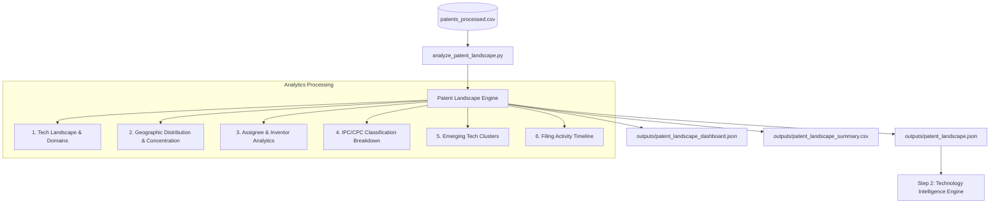

# Patent Landscape Analysis — Milestone 3 Document

## Overview & Architecture

The **Patent Landscape Analysis** module extracts high-level patent intelligence from processed patent datasets. Moving beyond basic statistical aggregations, this module synthesizes multi-dimensional insights across technical domains, geographic concentrations, organizational assignees, leading inventors, IPC/CPC classification patterns, and emerging technology keyword clusters.

The structured outputs generated by this module serve as the primary foundational context for downstream modules in Milestone 3, notably the **Technology Intelligence Engine** and **Innovation Scoring Workflows**.

---

## Workflow Diagram



---

## Output Schemas

### 1. `patent_landscape.json` (Full Intelligence Schema)
```json
{
  "metadata": {
    "total_patents_analyzed": 5000,
    "unique_domains_count": 6,
    "countries_represented": 12,
    "innovation_concentration_hhi_top3_share": 68.5
  },
  "technology_landscape": {
    "Robotics & AI": {
      "total_patents": 1200,
      "share_percentage": 24.0,
      "top_country": "US",
      "top_assignee": "Cyberdyne Systems",
      "top_ipc_cpc": "G06N",
      "top_keywords": ["neural networks", "deep learning", "autonomous control"],
      "filing_trend": "Growing"
    }
  },
  "geographic_distribution": [
    {
      "country_code": "US",
      "patent_count": 1850,
      "share_percentage": 37.0,
      "primary_technology_domain": "Robotics & AI"
    }
  ],
  "top_assignees": [
    {
      "assignee_name": "Cyberdyne Systems",
      "patent_count": 320,
      "primary_domain": "Robotics & AI",
      "headquarters_country": "US",
      "patent_statuses": { "GRANTED": 210, "FILED": 110 }
    }
  ],
  "leading_inventors": [
    {
      "inventor_name": "Dr. Miles Dyson",
      "patent_count": 45,
      "primary_domain": "Robotics & AI",
      "primary_assignee": "Cyberdyne Systems"
    }
  ],
  "ipc_cpc_classifications": [
    {
      "code": "G06N",
      "count": 650,
      "share_percentage": 13.0
    }
  ],
  "emerging_technology_clusters": [
    {
      "cluster_name": "Artificial Intelligence & ML",
      "patent_volume": 1420,
      "share_percentage": 28.4,
      "top_emerging_terms": ["neural", "transformer", "reinforcement", "vision", "LLM"]
    }
  ],
  "filing_activity_timeline": {
    "timeline": [
      { "year": 2020, "filings": 850, "growth_percentage": null },
      { "year": 2021, "filings": 920, "growth_percentage": 8.24 }
    ],
    "average_growth_rate": 6.5,
    "overall_trend": "Increasing"
  }
}
```

### 2. `patent_landscape_dashboard.json` (UI Analytics Data)
Designed for frontend visual components, summary KPI widgets, geographic maps, and trend line charts.

### 3. `patent_landscape_summary.csv` (Tabular Export)
Columns: `Domain`, `Total_Patents`, `Share_Percentage`, `Top_Country`, `Top_Assignee`, `Top_IPC_CPC`, `Emerging_Keywords`, `Filing_Trend`.

---

## Verification & Validation

Run the automated test suite from the `backend/` root directory:
```bash
cd backend
python verify_patent_landscape.py
```

Expected Output:
```text
=============================================
PATENT LANDSCAPE ANALYSIS
=============================================

[OK] Patent Dataset Loaded

[OK] Technology Landscape Generated

[OK] Geographic Analysis Completed

[OK] Technology Clusters Generated

[OK] Assignee Statistics Generated

[OK] Dashboard Data Generated

[OK] Summary CSV Generated

=============================================

Verification completed successfully.
```

---

## Next Steps: Step 2 — Technology Intelligence Engine

With the patent landscape baseline established:
1. **Technology Maturity Assessment**: Evaluate TRL (Technology Readiness Levels) by cross-referencing filing timelines with grant conversion rates.
2. **Competence & Hype Detection**: Identify saturated technology spaces versus accelerating whitespace opportunities.
3. **Synergy Scoring**: Intersect patent clusters with publication research fields to map commercialization pathways.
