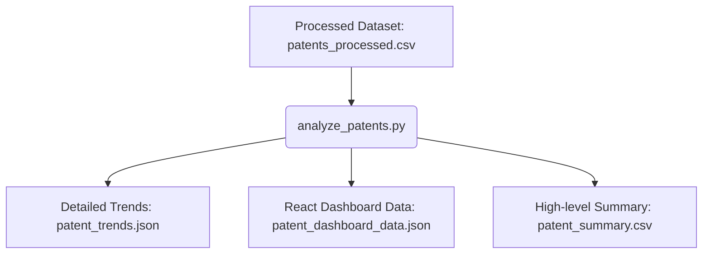

# Patent Trend Analysis Module

## Overview
The Patent Trend Analysis module provides backend analytical capabilities to compute trends, distributions, filing timelines, inventor activity, and technology domains from the preprocessed patents dataset. These computed results allow the Research Intelligence Dashboard to load high-fidelity statistics instantly without the need for client-side processing.

---

## Workflow
The patent trends pipeline processes data through the following stages:



1. **Ingestion**: Reads the clean patent record corpus from `datasets/processed/patents/patents_processed.csv`.
2. **Analysis**: Groups records, extracts timeline trends, parses classification strings, and counts text occurrences.
3. **Data Sanitization**: Excludes data placeholders such as `"Unknown Inventor"`, `"Unknown Assignee"`, `"No Keywords"`, and `"Unknown Country"` to maintain data cleanliness.
4. **Serialization**: Exports findings in detailed JSON, chart-optimized JSON, and flat CSV summary formats.

---

## Analytics Generated

### 1. Patents per Publication Year
- Annual counts of patents published chronologically.
- Extracted using the first 4 characters of `Publication_Date`.

### 2. Chronological Activity Timeline
- Tracks patent filings over time, including:
  - **Year-over-Year Growth Rate**: Growth percentage `((Current - Prev) / Prev) * 100`. If previous year count is 0, growth is set to `null` to avoid zero-division errors.
  - **Average Growth Rate**: Mean growth percentage across all transitions.
  - **Trend Classification**: Automatically classifies overall trend as `"Increasing"` (average growth > 5%), `"Declining"` (average growth < -5%), or `"Stable"` (otherwise).

### 3. Patents by Technology Domain
- Frequency count of patents across 25 technology domains (e.g., *Natural Language Processing*, *Artificial Intelligence*, *Biotechnology*).

### 4. Average Patents per Year per Domain
- Grouped by technology domain and publication year to compute the average annual patent count for each domain, helping identify research output consistency.

### 5. Top 10 Assignees
- Leaderboard ranking of the organizations/assignees holding the patents, excluding `"Unknown Assignee"`.

### 6. Top 10 Inventors
- Individual inventor frequency ranking compiled by splitting comma-separated lists, excluding `"Unknown Inventor"`.

### 7. Patent Status Distribution
- Splitting counts and percentages of patents by current status (e.g., `"GRANTED"`, `"FILED"`).

### 8. Country-wise Patent Distribution
- Frequency of patents grouped by country of jurisdiction, excluding `"Unknown Country"`.

### 9. Top IPC/CPC Classifications
- Extracted from `IPC_or_CPC_Classification` by splitting the pipe `|` symbol. Keeps the IPC/CPC scheme tag (e.g. `G06F 17/67 (IPC)` or `H04L 9/49 (CPC)`) for high-fidelity classification scheme representation.

### 10. Top 20 Keywords
- Frequent terms extracted from comma-separated list of keywords, excluding `"No Keywords"`.

### 11. Dataset Summary
- High-level metrics:
  - Total patents count.
  - Unique inventors count (excluding `"Unknown Inventor"`).
  - Unique assignees count (excluding `"Unknown Assignee"`).
  - Publication years range covered (min and max years, excluding year `0`).
  - Total count and full list of technology domains covered.

---

## Output File Descriptions

All output files are generated under the `datasets/analytics/` directory:

### 1. `patent_trends.json`
Contains a structured, nested JSON object of all calculated analytics.
- **Use Case**: Detailed backend data retrieval, REST API payloads, and general innovation audits.
- **Format**:
  ```json
  {
    "patents_per_year": { "2021": 124, "2022": 917, ... },
    "patent_activity_timeline": {
      "timeline": [ { "year": 2021, "patents": 124, "growth_percentage": null }, ... ],
      "average_growth_rate": 86.39,
      "trend": "Increasing"
    },
    "patents_by_technology_domain": { "Natural Language Processing": 200, ... },
    "average_patents_per_domain": { "Artificial Intelligence": 28.57, ... },
    "top_assignees": { ... },
    "top_inventors": { ... },
    ...
  }
  ```

### 2. `patent_dashboard_data.json`
Chart-friendly JSON layout where keys are structured as arrays of objects.
- **Use Case**: Direct mapping into UI charting libraries (e.g. Recharts, Chart.js) inside the React frontend.
- **Format**:
  ```json
  {
    "patent_activity_timeline": {
      "timeline": [ { "year": 2021, "patents": 124, "growth_percentage": null }, ... ],
      "average_growth_rate": 86.39,
      "trend": "Increasing"
    },
    "patents_by_technology_domain": [ { "domain": "Natural Language Processing", "count": 200 }, ... ],
    ...
  }
  ```

### 3. `patent_summary.csv`
A simple key-value flat file representing the dataset's high-level summary metrics.
- **Use Case**: Reporting, quick human inspection, and business intelligence exports.
- **Format**:
  ```csv
  Metric,Value
  Total Patents,5000
  Unique Inventors,400
  Unique Assignees,25
  Start Year,2021
  End Year,2027
  Total Technology Domains,25
  ```

---

## Future Research Intelligence Dashboard Integration
For future dashboard development:
- **Vite/React Setup**: Fetch `patent_dashboard_data.json` from the server.
- **Visual Mapping**:
  - `patent_activity_timeline` → **Line Chart** displaying patent filing trends, with a top **Trend Badge** showing `Increasing`, `Stable`, or `Declining` based on the interpretation metadata.
  - `patents_by_technology_domain` → **Bar Chart** showing volume of patents per domain.
  - `average_patents_per_domain` → **Comparison Chart** comparing domain research stability.
  - `top_assignees` and `top_inventors` → **Leaderboard Tables**.
  - `patent_status_distribution` → **Donut / Pie Chart** highlighting IP readiness.
  - `summary_metrics` → **Scorecard Cards** displaying Total Patents, Unique Inventors, and Unique Assignees.
