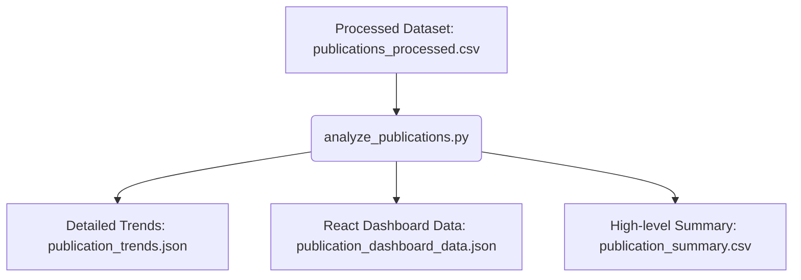

# Publication Trend Analysis Module

## Overview
The Publication Trend Analysis module provides backend analytical capabilities to compute trends, distributions, active researchers, and citation profiles from the processed OpenAlex scientific publications dataset. These pre-computed analytics allow the user interface to load visualization-ready statistics instantly.

---

## Workflow
The pipeline operates as follows:



1. **Ingestion**: The script reads the preprocessed publication records from `datasets/processed/publications/publications_processed.csv`.
2. **Analysis**: Runs calculations to extract frequency tables, compute metrics, and partition open/closed access metrics.
3. **Data Sanitization**: Excludes data-collection placeholder artifacts (like `"Unknown Journal"`, `"Unknown Author"`, and `"No Keywords"`) to maintain statistical accuracy.
4. **Serialization**: Saves results in three distinct formats targeting backend, frontend, and reporting systems.

---

## Generated Analytics

### 1. Publications per Year
- Grouped counts of scientific papers published annually.
- Filters out placeholder years (e.g., Year `0` resulting from missing data).
- Chronologically sorted.

### 2. Publications by Research Domain
- Frequency distribution across 25 distinct scientific domains (e.g., *Artificial Intelligence*, *Quantum Computing*, *Mechanical Engineering*).
- Sorted in descending order.

### 3. Top 10 Journals
- Count of publications by journal.
- Excludes `"Unknown Journal"` to avoid skewing publisher standings.

### 4. Top 20 Active Authors
- Comma-separated list extraction, counting individual authors across all works.
- Excludes `"Unknown Author"`.
- Highlights the most active researchers in the dataset.

### 5. Open Access vs Closed Access Distribution
- Absolute counts and percentage distributions of open vs. closed access research publications based on the `Open_Access` status.

### 6. Citation Statistics
- General metrics calculated from `Citation_Count`:
  - **Total Citations**: Cumulative impact.
  - **Average Citations**: Mean citations per paper (rounded to 2 decimal places).
  - **Maximum Citations**: Peak citation count for a single publication.
  - **Minimum Citations**: Lowest citation count.

### 7. Top 20 Keywords
- Frequent terms extracted from comma-separated list of keywords.
- Excludes `"No Keywords"`.

### 8. Dataset Summary
- Total publication count.
- Unique authors count (excluding `"Unknown Author"`).
- Unique journals count (excluding `"Unknown Journal"`).
- Range of years covered (min and max years, excluding year `0`).
- Total count and full list of research domains covered.

---

## Output Files

The script generates three output files under `datasets/analytics/`:

### 1. `publication_trends.json`
Contains a structured, nested JSON object of all calculated analytics:
- **Use Case**: Detailed backend data retrieval, REST API payloads, and general research audits.
- **Format**:
  ```json
  {
    "publications_per_year": { "2020": 273, "2021": 202, ... },
    "publications_by_domain": { "Artificial Intelligence": 200, ... },
    "top_journals": { "Choice Reviews Online": 80, ... },
    "top_authors": { "Rajkumar Buyya": 22, ... },
    "open_access_distribution": { "open_access_count": 1814, ... },
    "citation_statistics": { "total_citations": 9941056, ... },
    "top_keywords": { "Computer science": 3644, ... },
    "dataset_summary": { ... }
  }
  ```

### 2. `publication_dashboard_data.json`
Chart-friendly JSON layout where keys are structured as arrays of objects.
- **Use Case**: Direct, effortless mapping into charting libraries such as Recharts or Chart.js inside the React frontend.
- **Format**:
  ```json
  {
    "publications_per_year": [ { "year": 2020, "count": 273 }, ... ],
    "publications_by_domain": [ { "domain": "Artificial Intelligence", "count": 200 }, ... ],
    ...
  }
  ```

### 3. `publication_summary.csv`
A simple key-value flat file representing the dataset's high-level summary metrics.
- **Use Case**: Reporting, quick human inspection, and business intelligence export.
- **Format**:
  ```csv
  Metric,Value
  Total Publications,5000
  Unique Authors,15428
  Unique Journals,1574
  Start Year,1892
  End Year,2026
  Total Research Domains,25
  ```

---

## Research Intelligence Dashboard Integration
For future dashboard development:
- **Vite/React Setup**: Fetch `publication_dashboard_data.json` directly from an API endpoint or static public directory.
- **Visual Mapping**:
  - `publications_per_year` → **Line Chart** showing annual scientific output.
  - `publications_by_domain` → **Horizontal Bar Chart** highlighting domain distribution.
  - `top_journals` and `top_authors` → **Leaderboard Tables**.
  - `open_access_distribution` → **Donut / Pie Chart**.
  - `citation_statistics` and `summary_metrics` → **Scorecard Cards** displaying Total Publications, Unique Authors, and Citations.
