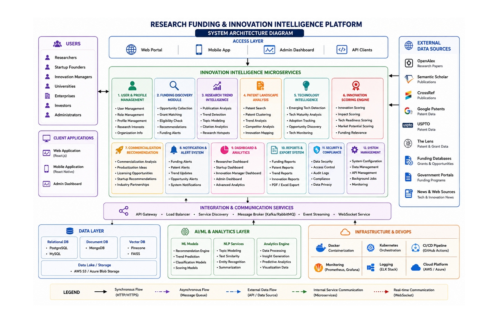

# System Architecture

The following diagram illustrates the overall architecture of the Research Funding & Innovation Intelligence Platform.

## Architecture Overview

The system follows a modular architecture consisting of:

1. Frontend
   - React.js
   - Tailwind CSS
   - Axios

2. Backend
   - FastAPI
   - Python
   - REST APIs

3. Database
   - PostgreSQL

4. Data Sources
   - arXiv
   - Grants.gov
   - Google Patents

5. Data Processing
   - Data Collection
   - Data Cleaning
   - Data Preprocessing
   - Exploratory Data Analysis

6. Recommendation Engine
   - Machine Learning
   - Similarity Matching

7. Deployment
   - Docker
   - GitHub