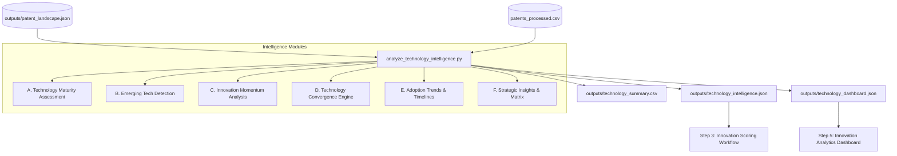

# Technology Intelligence Engine — Documentation

## Overview & Architecture

The **Technology Intelligence Engine** (Step 2) processes the outputs from Step 1 (**Patent Landscape Analysis**) alongside granular patent dataset metrics to extract strategic technology intelligence. 

Moving beyond basic statistical distributions, this module synthesizes multi-dimensional intelligence across:
1. **Technology Maturity Assessment**: Classifies domains into Emerging, Growing, Mature, or Declining.
2. **Emerging Technology Detection**: Identifies rapid growth areas using filing velocity, keyword expansion, and assignee dynamics.
3. **Innovation Momentum Analysis**: Measures domain acceleration through patent growth, inventor activity, assignee expansion, and geographic spread.
4. **Technology Convergence Analysis**: Detects multi-domain synergies (e.g. AI + IoT $\rightarrow$ AIoT, AI + Biotech $\rightarrow$ Bio-AI).
5. **Technology Adoption Trends**: Tracks timeline adoption curves, geographic adoption breadth, and industry sector leaderboards.
6. **Strategic Technology Recommendations**: Provides rule-based strategic actions, risk ratings, opportunity scores, and priority ranks.

The outputs generated by this engine serve as the foundation for the **Innovation Scoring Workflow (Step 3)** and the **Innovation Analytics Dashboard (Step 5)**.

---

## Workflow Diagram



---

## Intelligence Methodology & Rules

### 1. Technology Maturity Classification Rules

Every technology domain is classified into one of four maturity stages based on volume, growth, and recent filing velocity:

- **Emerging**: High recent filing ratio ($>35\%$) and YoY growth rate ($>10\%$) with early-stage volume ($ \le 6\%$ market share).
- **Growing**: Strong positive growth rate ($ \ge 5\%$) or positive trend indicator with expanding volume.
- **Mature**: High patent volume with stable filing growth ($-5\%$ to $+5\%$).
- **Declining**: Negative filing growth ($<-5\%$) or contraction in filing velocity.

### 2. Innovation Momentum Formula

Innovation momentum measures the velocity and breadth of technological progress. A composite score ($0 - 100$) is computed using four weighted factors:

$$\text{Momentum Score} = (S_{\text{growth}} \times 0.35) + (S_{\text{assignee}} \times 0.25) + (S_{\text{inventor}} \times 0.20) + (S_{\text{geo}} \times 0.20)$$

- **High Momentum**: Score $\ge 60.0$
- **Medium Momentum**: $35.0 \le \text{Score} < 60.0$
- **Low Momentum**: Score $< 35.0$

### 3. Technology Convergence Methodology

Technology convergence identifies cross-domain co-occurrences where distinct technical areas combine to form hybrid innovation fields (e.g., Artificial Intelligence + Internet of Things $\rightarrow$ AIoT).

- **Co-occurrence Score**: Evaluates shared keyword frequencies, IPC/CPC classification overlaps, and combined volume relative to the total patent corpus.
- **Synergy Momentum**: Averages component domain momentum scores to predict hybrid field trajectory.

---

## Generated Output Schemas

### 1. `backend/outputs/technology_intelligence.json`
Complete structured intelligence payload:

```json
{
  "metadata": {
    "total_patents_analyzed": 5000,
    "unique_domains_analyzed": 25,
    "emerging_technologies_count": 6,
    "convergence_pairs_identified": 6,
    "engine_status": "Active"
  },
  "technology_maturity": {
    "Artificial Intelligence": {
      "maturity_status": "Growing",
      "patent_volume": 200,
      "share_percentage": 4.0,
      "growth_rate_percentage": 12.5,
      "recent_filing_ratio": 30.0,
      "filing_activity_trend": "Growing",
      "indicators": {
        "volume_tier": "High",
        "velocity": "Accelerating",
        "market_readiness": "High"
      }
    }
  },
  "emerging_technologies": [
    {
      "technology_name": "Artificial Intelligence",
      "maturity_stage": "Growing",
      "growth_percentage": 12.5,
      "patent_volume": 200,
      "keyword_velocity": ["automation", "system", "adaptive"],
      "assignee_expansion_count": 15
    }
  ],
  "innovation_momentum": {
    "Artificial Intelligence": {
      "momentum_score": 78.4,
      "momentum_level": "High",
      "patent_growth_rate": 12.5,
      "inventor_activity_count": 80,
      "assignee_count": 15,
      "geographic_spread_count": 3
    }
  },
  "technology_convergence": [
    {
      "primary_domain": "Artificial Intelligence",
      "secondary_domain": "Internet of Things",
      "converged_technology_name": "AIoT (Artificial Intelligence of Things)",
      "co_occurrence_score": 85.0,
      "synergy_momentum": 75.2,
      "shared_keywords": ["automation", "adaptive", "sensor", "network"]
    }
  ],
  "adoption_trends": {
    "Artificial Intelligence": {
      "adoption_stage": "Early Majority",
      "geographic_adoption": { "US": 200 },
      "industry_adoption_leaders": { "Institute of Technology": 200 }
    }
  },
  "strategic_insights": {
    "Artificial Intelligence": {
      "status": "Growing",
      "recommendation": "High investment potential — Accelerate R&D funding...",
      "risk_level": "Medium",
      "opportunity_score": 81.3,
      "priority_rank": 1
    }
  }
}
```

### 2. `backend/outputs/technology_dashboard.json`
Optimized payload for frontend UI components (charts, KPIs, radar, graph networks).

### 3. `backend/outputs/technology_summary.csv`
Tabular export containing columns:
- `Technology_Domain`
- `Maturity_Status`
- `Innovation_Momentum`
- `Growth_Percentage`
- `Geographic_Spread_Count`
- `Top_Assignee`
- `Strategic_Recommendation`

---

## Foundation for Downstream Steps

1. **Innovation Scoring Workflow (Step 3)**:
   - Utilizes `technology_maturity`, `innovation_momentum`, and `opportunity_score` as key weighting parameters when scoring individual patents and research proposals.
2. **Innovation Analytics Dashboard (Step 5)**:
   - Ingests `technology_dashboard.json` directly into frontend React components for interactive visualization (Maturity Breakdown Chart, Momentum Radar, Convergence Graph, Strategic Matrix).

---

## Verification & Execution

To execute the engine and verify all outputs:

```bash
cd backend
python analytics/analyze_technology_intelligence.py
python verify_technology_intelligence.py
```
