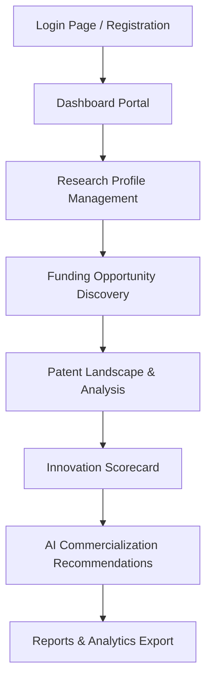
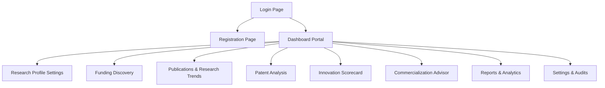
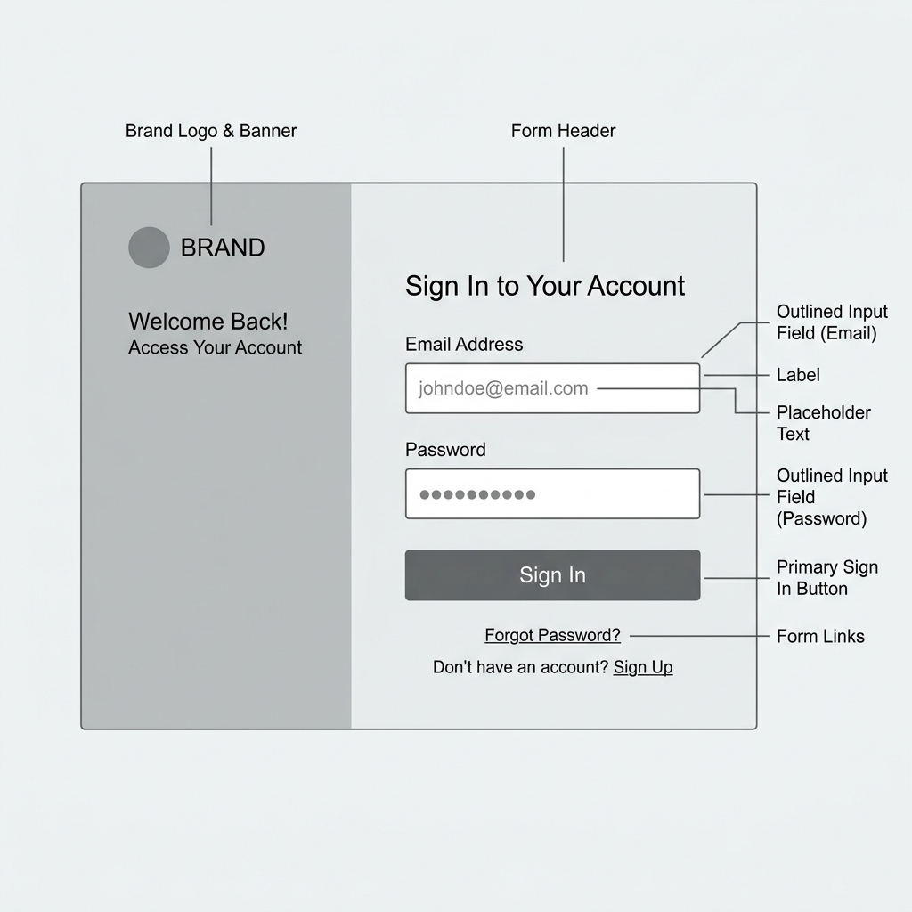
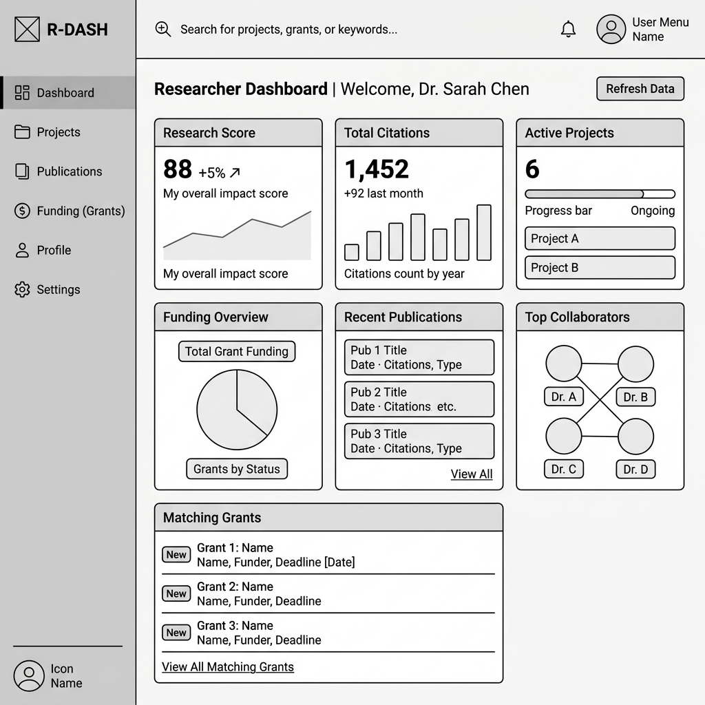
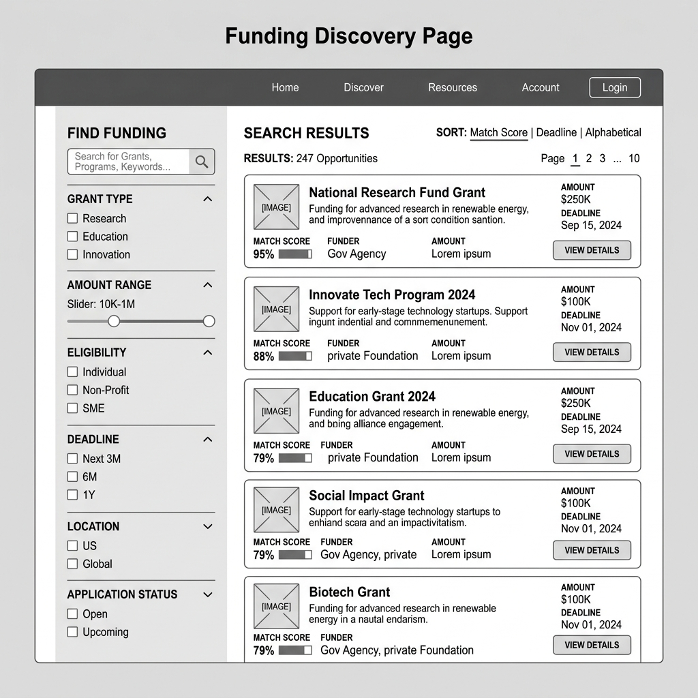
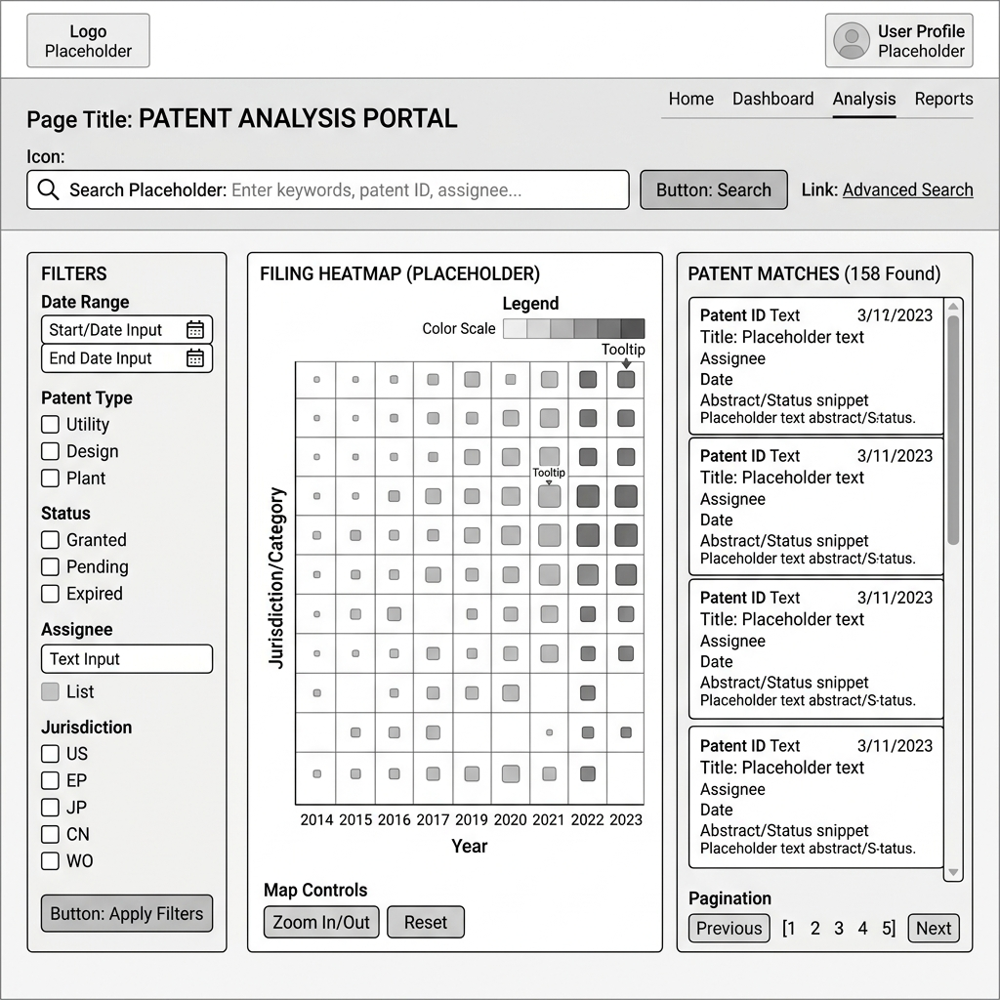
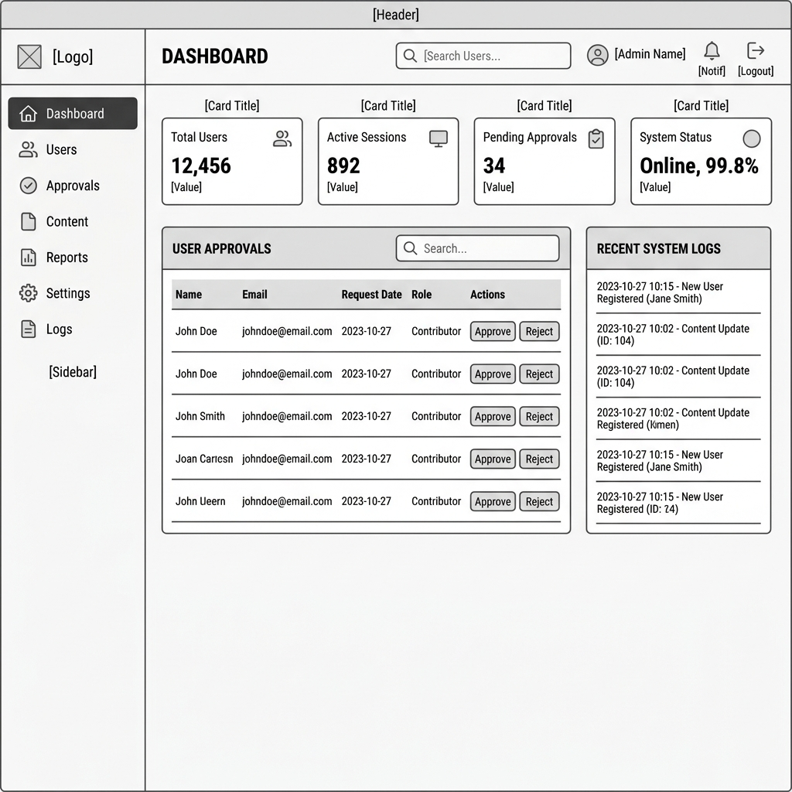

# UI Wireframes & Workflow Planning
**Project**: Research Funding & Innovation Intelligence Platform  
**Milestone**: Milestone 1 - UI & UX Design Documentation  

---

## 1. User Flow Diagram

The flowchart below demonstrates the core user flow sequence as a researcher or founder interacts with the platform's primary modules:



---

## 2. Navigation Map

The navigation structure highlights the hierarchical layout and structural connections between the pages in the sidebar navigation:



---

## 3. Core Visual Wireframes (Milestone 1 Artifacts)

Below are the key low-fidelity wireframe interfaces generated for review:

### A. Login Page Wireframe


### B. Researcher Dashboard Wireframe


### C. Funding Discovery Page Wireframe


### D. Patent Analysis Page Wireframe


### E. Administrator Dashboard Wireframe


---

## 4. 13 Page Low-Fidelity Layout Specifications

Each page detail contains component descriptions, ASCII structures, responsive adaptations, and AI integrations.

---

### Page 1: Login Page
* **Purpose**: Secure entryway for users. Split desktop design highlights platform capabilities.

#### ASCII Schematic Layout
```
+------------------------------------------+------------------------------------------+
|                                          |                                          |
|                                          |                [ Logo ]                  |
|                 [ BRAND ]                |                                          |
|                                          |            Sign In to Account            |
|       Research Funding & Innovation      |                                          |
|           Intelligence Platform          |        Email Address                     |
|                                          |        [ email@domain.com            ]   |
|     * Discover global grant calls        |                                          |
|     * Map intellectual property (IP)     |        Password             [ Forgot? ]  |
|     * Evaluate innovation scoring        |        [ **********                  ]   |
|                                          |                                          |
|                                          |        [  Sign In Button (Primary)  ]    |
|                                          |                                          |
|                                          |        Don't have an account? [Register] |
+------------------------------------------+------------------------------------------+
```

#### Component Placement & React + Tailwind Blueprint
* **Container**: `grid grid-cols-1 lg:grid-cols-12 min-h-screen`
* **Left Brand Banner** (`hidden lg:flex lg:col-span-5 bg-slate-900 text-white flex-col justify-center p-12`): Show logo, tagline, and bullet highlights of AI features.
* **Right Form Column** (`col-span-12 lg:col-span-7 flex flex-col justify-center p-8 sm:p-12 bg-white`):
  - Form wrapper centered with maximum width (`max-w-md w-full mx-auto`).
  - Inputs (`w-full px-4 py-2 border rounded-md focus:ring-2 focus:ring-blue-500`).
  - Submit Button (`w-full bg-blue-600 hover:bg-blue-700 text-white font-semibold py-2 rounded-md transition`).

#### Responsive & AI Highlights
- **Mobile**: Left banner collapses (`hidden`), showing only the clean login form card centered.
- **AI Highlight**: Simple helper text or dynamic login message: *"Welcome back! AI mapped 47 new matching grants since yesterday."*

---

### Page 2: Registration Page
* **Purpose**: Account registration with dynamic user role selection (Researcher, Founder, Corporate, Administrator).

#### ASCII Schematic Layout
```
+------------------------------------------+------------------------------------------+
|                                          |                                          |
|                 [ BRAND ]                |                [ Logo ]                  |
|                                          |             Create Account               |
|       Research Funding & Innovation      |                                          |
|           Intelligence Platform          |     First Name           Last Name       |
|                                          |     [ Jane       ]      [ Doe        ]   |
|     Select your profile type to          |                                          |
|     personalize recommendation feeds.    |     Email Address                        |
|                                          |     [ jane.doe@institution.edu       ]   |
|     * Real-time notifications            |                                          |
|     * Secure institution verification    |     Account Type / Primary Role          |
|                                          |     [ ( ) Researcher   ( ) Startup    ]   |
|                                          |     [ ( ) Manager      ( ) Admin      ]   |
|                                          |                                          |
|                                          |     Password                             |
|                                          |     [ **********                     ]   |
|                                          |                                          |
|                                          |     [  Register Account (Primary)  ]     |
+------------------------------------------+------------------------------------------+
```

#### Component Placement & React + Tailwind Blueprint
* **Container**: `grid grid-cols-1 lg:grid-cols-12 min-h-screen`
* **Form Container** (`max-w-xl w-full mx-auto`): Two-column input fields for First/Last name (`grid grid-cols-2 gap-4`).
* **Role Selection Grid** (`grid grid-cols-2 gap-3 mb-4`): Stylized radio card components with borders that highlight when selected to guide the user's role-based navigation flow.
* **Tailwind Class**: `border rounded-lg p-3 cursor-pointer hover:border-blue-500 transition focus-within:ring-2`

#### Responsive & AI Highlights
- **Mobile**: Grid splits change from horizontal to stacked columns (`grid-cols-1 gap-y-3`).
- **AI Highlight**: Tooltip explanations under each role explaining how the recommendation engine customizes algorithms depending on choice.

---

### Page 3: Researcher Dashboard
* **Purpose**: Overview of research metrics, current publication output, h-index tracking, and targeted AI funding matching.

#### ASCII Schematic Layout
```
+-------------------------------------------------------------------------------------+
| [=] Logo/Brand   | [Search publications, grants...]            (Alerts: 3) [JD]     |
+------------------+------------------------------------------------------------------+
| - Dashboard      | Researcher Console / Jane Doe, Ph.D.                             |
| - Funding        |                                                                  |
| - Publications   | +-----------------+ +-----------------+ +------------------------+ |
| - Patents        | | Research Score  | | Citations/h-idx | | Pending Grants         | |
| - Recommendations| |    78.40  [+2%] | |  2,450 / h-18   | | 2 Active (Val: $450k)  | |
| - Analytics      | +-----------------+ +-----------------+ +------------------------+ |
| - Settings       |                                                                  |
|                  | +-------------------------------------+ +------------------------+ |
|                  | | Publication Impact Trend (Chart)   | | Matching Funding (AI)  | |
|                  | | [Line Chart: citations over years ] | | * Horizon Europe - $5M | |
|                  | |                                     | | * NSF CAREER - $500k   | |
|                  | +-------------------------------------+ +------------------------+ |
|                  |                                                                  |
|                  | +----------------------------------------------------------------+ |
|                  | | Recent Works & Co-Authors Table                                | |
|                  | +----------------------------------------------------------------+ |
+------------------+------------------------------------------------------------------+
```

#### Component Placement & React + Tailwind Blueprint
* **Layout Structure**: Top metric cards row (`grid grid-cols-1 md:grid-cols-3 gap-6 mb-6`).
* **Middle Section Layout**: Two columns split 2:1 (`grid grid-cols-1 lg:grid-cols-3 gap-6`).
  - Left Panel (`lg:col-span-2 bg-white p-6 border rounded-lg`): Holds the trend visualization placeholder.
  - Right Panel (`lg:col-span-1 bg-gradient-to-br from-blue-50 to-indigo-50 border p-6 rounded-lg`): AI Recommendation card container.
* **Bottom Section Layout**: Wide single-column table card (`w-full bg-white border rounded-lg`).

#### Responsive & AI Highlights
- **Mobile**: Columns stack vertically (`grid-cols-1`). Sidebar collapses into a hamburger overlay.
- **AI Highlight**: Sits in the top-right block, featuring customized grant opportunities matched directly to the user's mapped `profile_interests` database entries.

---

### Page 4: Startup Founder Dashboard
* **Purpose**: Tracks IP landscape, startup innovation scores, investor-readiness levels, and patent timelines.

#### ASCII Schematic Layout
```
+-------------------------------------------------------------------------------------+
| [=] Logo/Brand   | [Search technology fields...]               (Alerts: 5) [SF]     |
+------------------+------------------------------------------------------------------+
| - Dashboard      | TechStart Inc. Portal / Founder Console                          |
| - Funding        |                                                                  |
| - Patents        | +-----------------+ +-----------------+ +------------------------+ |
| - Publications   | | Innovation Rank | | Active Patents  | | Commercial Rating    | |
| - Recommendations| |    82.10  [+4%] | |  3 Granted / 2  | |  Investment Grade A   | |
| - Analytics      | +-----------------+ +-----------------+ +------------------------+ |
| - Settings       |                                                                  |
|                  | +-------------------------------------+ +------------------------+ |
|                  | | Patent Filing Landscape (Chart)     | | Commercialization suggestions| |
|                  | | [Bar Chart: Competitors vs. Self]   | | * Tech Transfer Opps   | |
|                  | |                                     | | * Partner Match: MIT   | |
|                  | +-------------------------------------+ +------------------------+ |
|                  |                                                                  |
|                  | +----------------------------------------------------------------+ |
|                  | | IP Competitor Track & Alerts List                              | |
|                  | +----------------------------------------------------------------+ |
+------------------+------------------------------------------------------------------+
```

#### Component Placement & React + Tailwind Blueprint
* **Top Metric Cards Container**: Three columns (`grid grid-cols-1 sm:grid-cols-2 lg:grid-cols-3 gap-4`).
* **Patent Landscape Panel**: Multi-bar visual representation placeholder (`bg-slate-50 flex items-center justify-center border-dashed border-2 h-64`).
* **Commercialization Panel**: Light bulb styled widget section highlighting strategic actions.

#### Responsive & AI Highlights
- **Mobile**: Grid columns auto-flow; navigation sidebar collapses to icon-only format.
- **AI Highlight**: Highlight card prompts founder: *"Action needed: Patent filed by competitor X overlaps with your core quantum cryptography claim. View analysis."*

---

### Page 5: Innovation Manager Dashboard
* **Purpose**: Higher-level institutional portal monitoring total IP pipeline, technology licensing status, and department scorecards.

#### ASCII Schematic Layout
```
+-------------------------------------------------------------------------------------+
| [=] Logo/Brand   | [Search faculty, technologies...]           (Alerts: 12) [IM]    |
+------------------+------------------------------------------------------------------+
| - Dashboard      | Office of Technology Transfer / University Administrator          |
| - Portfolio      |                                                                  |
| - Disclosures    | +-----------------+ +-----------------+ +------------------------+ |
| - Patents        | | Active Licenses | | Total Royalties | | Disclosure Queue       | |
| - Innovation     | |       18        | |   $1.2M USD     | | 8 Pending Review       | |
| - Reports        | +-----------------+ +-----------------+ +------------------------+ |
| - Settings       |                                                                  |
|                  | +-------------------------------------+ +------------------------+ |
|                  | | Technology Pipeline (Funnel Diagram)| | Department Performance | |
|                  | | [ Disclosure -> Evaluation -> IP   | | * CS / Engineering: 88 | |
|                  | |   -> Commercial Licensing Stage ]   | | * Bio-Medicine:    91 | |
|                  | +-------------------------------------+ +------------------------+ |
|                  |                                                                  |
|                  | +----------------------------------------------------------------+ |
|                  | | Latest Disclosures & Invention Filings Table                   | |
|                  | +----------------------------------------------------------------+ |
+------------------+------------------------------------------------------------------+
```

#### Component Placement & React + Tailwind Blueprint
* **Funnel Visualization**: Structured pipeline layout using CSS grid layers (`grid grid-cols-4 gap-2 text-center text-xs`).
* **Disclosure Queue**: Interactive notification badges displaying pending tasks requiring approvals.
* **Tailwind Class**: `relative overflow-hidden shadow-sm hover:shadow-md border border-slate-200 rounded-xl bg-white p-6`

#### Responsive & AI Highlights
- **Mobile**: Pipeline funnel collapses from a horizontal layout to a vertical step process list.
- **AI Highlight**: Department rankings showcase computed institutional innovation averages, powered by aggregate index algorithms.

---

### Page 6: Administrator Dashboard
* **Purpose**: System health, log monitoring, user registration approvals, role overrides, and AI task scheduling status.

#### ASCII Schematic Layout
```
+-------------------------------------------------------------------------------------+
| [=] Logo/Brand   | [Search logs, audits, users...]             (System: OK) [AD]    |
+------------------+------------------------------------------------------------------+
| - Dashboard      | Root Administrator Panel                                         |
| - User Management|                                                                  |
| - DB Backups     | +-----------------+ +-----------------+ +------------------------+ |
| - System Logs    | | Active Sessions | | API Latency     | | DB Health Status     | |
| - AI Settings    | |      240        | |    120 ms       | | Healthy (Sync OK)    | |
| - Audit Trail    | +-----------------+ +-----------------+ +------------------------+ |
|                  |                                                                  |
|                  | +-------------------------------------+ +------------------------+ |
|                  | | User Approval Queue (Table List)    | | AI Scraping Cron Jobs  | |
|                  | | * User: Jane Doe -> Approve/Deny    | | * Patents Feed: Idle   | |
|                  | | * User: John Smith -> Approve/Deny  | | * Grants Feed: Syncing  | |
|                  | +-------------------------------------+ +------------------------+ |
|                  |                                                                  |
|                  | +----------------------------------------------------------------+ |
|                  | | System Server CPU & Memory Usage Real-time Logs                | |
|                  | +----------------------------------------------------------------+ |
+------------------+------------------------------------------------------------------+
```

#### Component Placement & React + Tailwind Blueprint
* **System Metrics Container**: Grid layouts tracking metrics (`grid grid-cols-1 md:grid-cols-3 gap-4 mb-6`).
* **Approval Card Grid** (`flex flex-col space-y-3`): Details user signups requiring manual validation checks.
* **Cron/Task Monitoring list**: Clean list detailing background API execution updates (`divide-y divide-slate-100`).

#### Responsive & AI Highlights
- **Mobile**: Form fields shrink; dashboard grids scale to vertical rows (`col-span-12`).
- **AI Highlight**: System flags abnormal request spikes: *"Alert: AI Recommendations engine detected query spike from IP 192.168.1.50."*

---

### Page 7: Research Profile Management
* **Purpose**: Profile editor for researchers to sync ORCID, add academic details, edit biography, and specify interests.

#### ASCII Schematic Layout
```
+-------------------------------------------------------------------------------------+
| [=] Logo/Brand   | [Search...]                                                 [JD]     |
+------------------+------------------------------------------------------------------+
| - Dashboard      | Settings / Manage Research Profile                               |
| - Funding        |                                                                  |
| - Publications   | +--------------------------------------------------------------+ |
| - Patents        | | Profile Settings Card                                        | |
| - Recommendations| | [ Photo ] Jane Doe, Ph.D.                   [ Save Changes ] | |
| - Analytics      | | Title: [ Associate Professor             ]                   | |
| - Settings       | | Biography:                                                   | |
|                  | | [ Biography text input area...                           ]   | |
|                  | |                                                              | |
|                  | | ORCID ID: [ 0000-0002-1825-0097 ]  [ Sync ORCID Data ]       | |
|                  | | Institution: [ Massachusetts Institute of Technology     ]   | |
|                  | +--------------------------------------------------------------+ |
|                  |                                                                  |
|                  | +--------------------------------------------------------------+ |
|                  | | Research Keywords / Interests Tags                           | |
|                  | | [ Quantum Computing x ] [ Nanotech x ] [ + Add Tag ]         | |
|                  | +--------------------------------------------------------------+ |
+------------------+------------------------------------------------------------------+
```

#### Component Placement & React + Tailwind Blueprint
* **Form Grid**: Form layout splits into basic info and external sync details (`grid grid-cols-1 lg:grid-cols-2 gap-8`).
* **Tags Editor Panel**: Wrapped inline tags (`flex flex-wrap gap-2`).
* **Tailwind Class**: `inline-flex items-center bg-blue-50 text-blue-700 text-sm px-3 py-1 rounded-full font-medium`

#### Responsive & AI Highlights
- **Mobile**: Save button moves to sticky position at the bottom of the screen.
- **AI Highlight**: Highlight recommendation on keyword selection: *"Recommended additions: 'Quantum Cryptography' matches 8 of your publications. Click to add tag."*

---

### Page 8: Funding Discovery Page
* **Purpose**: Advanced search and filter panel for grants, proposals, and corporate sponsorships.

#### ASCII Schematic Layout
```
+-------------------------------------------------------------------------------------+
| [=] Logo/Brand   | [Search...]                                                 [JD]     |
+------------------+------------------------------------------------------------------+
| - Dashboard      | Funding Opportunity Discovery                                    |
| - Funding        |                                                                  |
| - Publications   | +------------------------+ +-----------------------------------+ |
| - Patents        | | Filters Panel          | | Grant Results List (45 matches)   | |
| - Recommendations| |                        | |                                   | |
| - Analytics      | | Keyword:               | | +-------------------------------+ | |
| - Settings       | | [ Quantum Computing  ] | | | NSF Quantum Research Grant   | | |
|                  | |                        | | | Deadline: Oct 15 | Amount: $2M| | |
|                  | | Agency:                | | | Match Score: 98% (Excellent)  | | |
|                  | | [ NSF             [v] ]| | +-------------------------------+ | |
|                  | |                        | |                                   | |
|                  | | Amount:                | | +-------------------------------+ | |
|                  | | [ Min ] - [ Max ]      | | | Horizon Europe Cryptography   | | |
|                  | |                        | | | Deadline: Nov 30 | Amount: €5M| | |
|                  | | Deadline:              | | | Match Score: 85% (High)       | | |
|                  | | [ Select Date...   [o] ]| | +-------------------------------+ | |
|                  | +------------------------+ +-----------------------------------+ |
+------------------+------------------------------------------------------------------+
```

#### Component Placement & React + Tailwind Blueprint
* **Split Layout**: Left filters sidebar (`w-full md:w-80 bg-white border-r p-6 shrink-0`), right search list container (`flex-1 p-6`).
* **Filters Stack**: Form layout with labels (`flex flex-col space-y-4`).
* **Grant Cards**: Clean, structured items (`hover:shadow-md transition duration-200 hover:border-blue-300`).

#### Responsive & AI Highlights
- **Mobile**: Left filters collapse into a slide-up bottom drawer overlay (`fixed inset-0 z-40 md:relative`).
- **AI Highlight**: Every grant lists a customized match score percentage (e.g. *98% Match*) dynamically calculated using the profile's mapped interests.

---

### Page 9: Publication Search & Research Trends Page
* **Purpose**: Scientific literature lookups and visual trend tracking of publication metrics.

#### ASCII Schematic Layout
```
+-------------------------------------------------------------------------------------+
| [=] Logo/Brand   | [Search...]                                                 [JD]     |
+------------------+------------------------------------------------------------------+
| - Dashboard      | Publications & Emerging Research Trends                          |
| - Funding        |                                                                  |
| - Publications   | [ Search Publications: e.g. Quantum Dot Cellular Automata     ]  |
| - Patents        |                                                                  |
| - Recommendations| +-------------------------------------+ +------------------------+ |
| - Analytics      | | Publication Citation Trend (Chart)  | | Emerging Keywords    | |
| - Settings       | | [Line Chart: Publication Volume and  | | * Graph Neural Nets  | |
|                  | |  Citations growth over 5 years]     | | * Post-Quantum Crypto| |
|                  | |                                     | | * CRISPR Diagnostics | |
|                  | +-------------------------------------+ +------------------------+ |
|                  |                                                                  |
|                  | +----------------------------------------------------------------+ |
|                  | | Publication Results List (Title, DOI, Abstract, Citations)    | |
|                  | +----------------------------------------------------------------+ |
+------------------+------------------------------------------------------------------+
```

#### Component Placement & React + Tailwind Blueprint
* **Top Search Container**: Centered search input (`w-full max-w-3xl mx-auto mb-6`).
* **Metrics Charts Grid**: Two columns split (`grid grid-cols-1 lg:grid-cols-3 gap-6 mb-6`).
  - Chart Container (`lg:col-span-2 bg-white border rounded-lg p-6`).
  - Emerging Keywords list (`lg:col-span-1 bg-white border rounded-lg p-6`).

#### Responsive & AI Highlights
- **Mobile**: Charts and tables wrap to single columns, adapting scrollbars where appropriate.
- **AI Highlight**: The "Emerging Keywords" panel suggests hot, trending research domains with high growth indicators.

---

### Page 10: Patent Analysis Page
* **Purpose**: Intellectual property tracking, competitor patent filing analysis, and technological landscape mappings.

#### ASCII Schematic Layout
```
+-------------------------------------------------------------------------------------+
| [=] Logo/Brand   | [Search...]                                                 [SF]     |
+------------------+------------------------------------------------------------------+
| - Dashboard      | Intellectual Property & Patent Analyzer                          |
| - Funding        |                                                                  |
| - Patents        | +--------------------------------------------------------------+ |
| - Publications   | | Search IP Domains: [ "Quantum Entanglement Router"     ]     | |
| - Recommendations| +--------------------------------------------------------------+ |
| - Analytics      |                                                                  |
| - Settings       | +-------------------------------------+ +------------------------+ |
|                  | | Patent Filing Heatmap / Timeline    | | Active Competitors     | |
|                  | | [ Heatmap Matrix or Scatter Plot ]  | | * IBM Research         | |
|                  | |                                     | | * Intel Labs           | |
|                  | +-------------------------------------+ +------------------------+ |
|                  |                                                                  |
|                  | +----------------------------------------------------------------+ |
|                  | | Patents Results List (Number, Status, Inventors, Filing Date)  | |
|                  | +----------------------------------------------------------------+ |
+------------------+------------------------------------------------------------------+
```

#### Component Placement & React + Tailwind Blueprint
* **Heatmap Grid Panel**: Container with fixed size layout representing a scatter plot or filing history (`bg-slate-900 border rounded-lg h-72 flex items-center justify-center`).
* **Active Competitors**: Vertical list card (`divide-y divide-slate-100`).
* **Patents Results Table** (`w-full overflow-x-auto bg-white border rounded-lg`).

#### Responsive & AI Highlights
- **Mobile**: Results tables are wrapped in a horizontally scrollable container to prevent layout breakage.
- **AI Highlight**: Competitor list is ranked by filing frequency and overlap score with the user's patent history.

---

### Page 11: Innovation Score Page
* **Purpose**: Displays computed innovation scores, breakdown parameters, and comparative peer benchmarking.

#### ASCII Schematic Layout
```
+-------------------------------------------------------------------------------------+
| [=] Logo/Brand   | [Search...]                                                 [JD]     |
+------------------+------------------------------------------------------------------+
| - Dashboard      | Innovation Performance Scorecard                                 |
| - Funding        |                                                                  |
| - Publications   | +------------------------+ +-----------------------------------+ |
| - Patents        | | Overall Score Indicator| | Breakdown Metrics                 | |
| - Recommendations| |                        | |                                   | |
| - Analytics      | |        84.50           | | * Publication Impact:   82.10     | |
| - Settings       | |     [Top 5% Tier]      | | * Patent Output:        76.40     | |
|                  | |                        | | * Funding Success Rate: 91.00     | |
|                  | +------------------------+ +-----------------------------------+ |
|                  |                                                                  |
|                  | +--------------------------------------------------------------+ |
|                  | | Peer Benchmark Comparisons (Radar Chart)                     | |
|                  | | [Radar Chart: Self vs. University Average vs. Global Peer]   | |
|                  | +--------------------------------------------------------------+ |
+------------------+------------------------------------------------------------------+
```

#### Component Placement & React + Tailwind Blueprint
* **Top Metric Split Grid**: Two column scorecard row (`grid grid-cols-1 md:grid-cols-3 gap-6 mb-6`).
  - Score display card (`md:col-span-1 bg-white border-2 border-blue-500 rounded-lg p-6 flex flex-col justify-center items-center`).
  - Breakdown details card (`md:col-span-2 bg-white border rounded-lg p-6`).
* **Radar Chart Container**: Center-aligned panel (`max-w-2xl mx-auto bg-white border rounded-lg p-6 mt-6`).

#### Responsive & AI Highlights
- **Mobile**: Grid columns wrap, and the radar chart container drops down below metrics.
- **AI Highlight**: Radar charts display simulated lines indicating target improvements matching recommended actions.

---

### Page 12: Commercialization Recommendation Page
* **Purpose**: AI recommendation console showing technology readiness levels (TRL) and tech-transfer matchmaking.

#### ASCII Schematic Layout
```
+-------------------------------------------------------------------------------------+
| [=] Logo/Brand   | [Search...]                                                 [SF]     |
+------------------+------------------------------------------------------------------+
| - Dashboard      | AI Commercialization Advisor                                     |
| - Funding        |                                                                  |
| - Patents        | +--------------------------------------------------------------+ |
| - Publications   | | Emerging Patent Technology Match: "Quantum Cryptographic Key"| |
| - Recommendations| | TRL: Stage 5 (Prototype Validated)      Score: 92% Match     | |
| - Analytics      | +--------------------------------------------------------------+ |
| - Settings       |                                                                  |
|                  | +-------------------------------------+ +------------------------+ |
|                  | | Strategic Next Steps                | | Matching Partners / VCs| |
|                  | | 1. File provisional PCT patent app  | | * Peak Venture Group   | |
|                  | | 2. Apply for NSF SBIR Phase 1 grant | | * Novartis Ventures    | |
|                  | | 3. Schedule tech transfer meeting   | | * Tech Accelerator MIT | |
|                  | +-------------------------------------+ +------------------------+ |
+------------------+------------------------------------------------------------------+
```

#### Component Placement & React + Tailwind Blueprint
* **TRL Card Header**: Top prominent card displaying status alerts (`bg-gradient-to-r from-blue-900 to-slate-900 text-white rounded-lg p-8`).
* **Next Steps Column**: Text instructions structured via an ordered list component (`space-y-4`).
* **Partner Match Cards**: Multi-column partner match elements (`grid grid-cols-1 md:grid-cols-3 gap-4`).

#### Responsive & AI Highlights
- **Mobile**: Side-by-side components reflow into single columns, adjusting padding values for accessibility.
- **AI Highlight**: The entire page is generated based on natural language processing of research and patent outputs.

---

### Page 13: Reports & Analytics Page
* **Purpose**: Portal to download compiled PDFs, filter performance history, and generate institutional dashboards.

#### ASCII Schematic Layout
```
+-------------------------------------------------------------------------------------+
| [=] Logo/Brand   | [Search...]                                                 [IM]     |
+------------------+------------------------------------------------------------------+
| - Dashboard      | Reports & Analytics Generator                                    |
| - Portfolio      |                                                                  |
| - Disclosures    | +--------------------------------------------------------------+ |
| - Patents        | | Filter Report Parameters                                     | |
| - Innovation     | | Date Range: [ Last 12 Months [v] ] Dept: [ Engineering [v] ]  | |
| - Reports        | | Format: [ (o) PDF  ( ) CSV  ( ) JSON ]                        | |
| - Settings       | +--------------------------------------------------------------+ |
|                  |                                                                  |
|                  | +-------------------------------------+ +------------------------+ |
|                  | | Report Generation Progress          | | Saved / Scheduled      | |
|                  | | [Progress bar: 65% Completed ]      | | * Monthly IP Audit     | |
|                  | |                                     | | * Q2 Funding Review  | |
|                  | | [  Generate Custom Report (Primary) ] | * Annual Faculty Score | |
|                  | +-------------------------------------+ +------------------------+ |
+------------------+------------------------------------------------------------------+
```

#### Component Placement & React + Tailwind Blueprint
* **Filters Area**: Row parameter fields wrapping dynamically (`flex flex-wrap gap-4 items-center`).
* **Action & Progress Panel**: Column configuration (`grid grid-cols-1 md:grid-cols-2 gap-6 mt-6`).
  - Left Container: progress status card (`bg-white border rounded-lg p-6`).
  - Right Container: historically generated downloads list (`bg-white border rounded-lg p-6`).

#### Responsive & AI Highlights
- **Mobile**: Horizontal inputs re-align as vertical lists (`w-full`).
- **AI Highlight**: Features a "Smart Summary" generator widget: *"AI automatically compiled a 2-page summary highlighting the 15% increase in biotechnology patent filings."*
