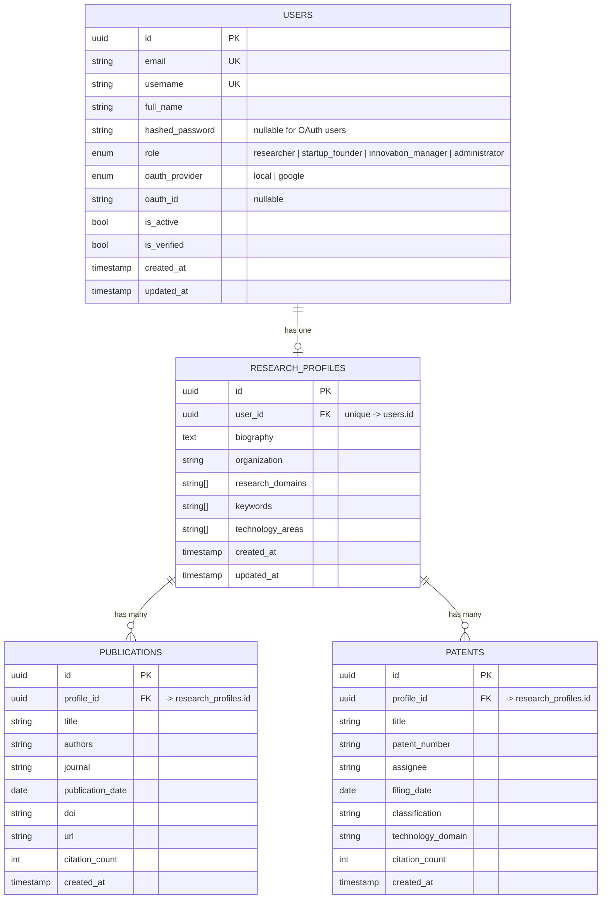

# Entity-Relationship Diagram — Milestone 1

This diagram covers the PostgreSQL schema delivered in Milestone 1: user
authentication/RBAC and Research Profile Management. MongoDB is used
separately (schema-less) for the `activity_logs` collection described below.



## Design notes

- **1:1 User ↔ ResearchProfile.** Every platform user *may* have exactly one
  research profile (`research_profiles.user_id` is unique + `ON DELETE CASCADE`).
  Profiles are created explicitly via `POST /research-profile/me` rather than
  automatically at registration, since Startup Founders / Innovation Managers
  may not need one immediately.
- **1:N ResearchProfile ↔ Publications / Patents.** These child tables carry
  the fields described in the Innovation Platform spec (Patent Title,
  Assignee, Filing Date, Classification, Technology Domain, Citation Count)
  and are consumed by the Research Trend Intelligence and Patent Landscape
  Analysis modules in Milestones 2–3.
- **Arrays over join tables** for `research_domains`, `keywords`, and
  `technology_areas`: Postgres native `ARRAY(String)` columns were chosen over
  a full tagging join-table schema to keep Milestone 1 simple; this can be
  normalized into a `tags` + `profile_tags` join table later without breaking
  the API contract, since the Pydantic schema already treats them as string
  lists.
- **Enums as native Postgres types** (`user_role`, `oauth_provider`) enforce
  valid values at the database layer, not just the application layer.

## MongoDB — `activity_logs` collection (secondary/document store)

Used for high-write, flexible-schema audit events (login attempts, OAuth
logins, registrations). Not modeled relationally because its shape will grow
significantly in later milestones (funding alerts, patent monitoring events,
notification history) without requiring schema migrations.

```json
{
  "_id": "ObjectId",
  "event_type": "login_success | login_failed | user_registered | oauth_login",
  "user_id": "uuid string | null",
  "email": "string | null",
  "success": true,
  "metadata": { "provider": "google" },
  "created_at": "ISODate"
}
```
